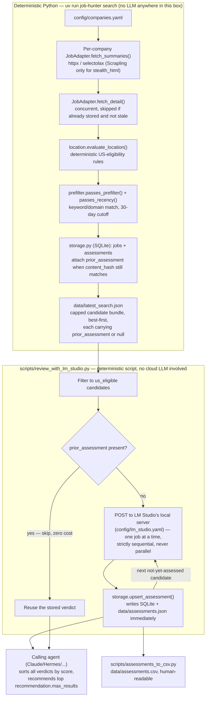

# Job Hunter

Job Hunter is a manual Python collector for employer career sites. It normalizes postings, applies a strict U.S.-eligibility filter, preserves history in SQLite, and emits a compact JSON candidate bundle for an LLM agent to compare with a resume. It does not schedule searches or apply to jobs.

Collection is HTTP-only (httpx) for almost every source. One adapter, `stealth_html`, is the deliberate exception: it drives a real headless stealth browser to get past a Cloudflare/Akamai-style bot-management challenge on a handful of sites (see [Source status](#source-status) and [The `stealth_html` adapter](#the-stealth_html-adapter) below) — an explicit, disclosed choice to defeat those sites' own anti-automation controls, not an oversight, made with the understanding that it can conflict with a site's Terms of Service.

## Setup

```bash
uv sync
cp config/candidate_profile.example.yaml config/candidate_profile.yaml
uv run job-hunter doctor
```

Edit `config/candidate_profile.yaml` with your preferences and optional resume path. ATS endpoints are intentionally configuration-driven. The checked-in source catalog started from 22 originally requested companies, gained Woven by Toyota (onboarded later), and dropped Audi and Mercedes-Benz (removed entirely — neither ever had a working endpoint) — 21 total. Sources without a currently verified anonymous endpoint, and where the `stealth_html` adapter (below) doesn't apply, fail explicitly instead of falling back to fabricated URLs.

**Your resume and filled-in `candidate_profile.yaml` are personal and never committed** — `.gitignore` excludes `config/candidate_profile.yaml` and any `config/*resume*` file except the checked-in `config/resume.example.md`. Bring your own resume as a `.md` file anywhere under `config/` matching that pattern (e.g. `config/my_resume.md`), point `candidate_profile.yaml`'s `resume_path` at it, and it stays local. `config/resume.example.md` is a fully fictional placeholder (fake name, contact info, and employers) showing the expected format, including the optional per-employer tailoring-note HTML comment the scoring skill can use.

Scoring candidates against your resume needs one more piece: a local model running in [LM Studio](https://lmstudio.ai/) (Developer tab > Start Server). Copy `config/lm_studio.example.yaml` to `config/lm_studio.yaml` (also gitignored) and edit `base_url` to match your server's address, then see [Agent skill](#agent-skill) for how `scripts/review_with_lm_studio.py` uses it.

### Source status

Run `uv run job-hunter source-status` for live, current numbers. As of the last verification pass:

**Every row below is deterministic Python — none of this runs an LLM.** Collection always executes as plain `asyncio`/httpx/selectolax(/Scrapling) code in `src/job_hunter/adapters/`, identically on every run, with zero API calls to Claude or any other model. The "Collection" column is included to make that explicit per source, not because it varies — it never does. The only place an LLM is (deliberately) involved is later and separately: the `job-hunter` skill scoring the JSON output against a resume, which reads this data, it doesn't produce it. Getting a *new* source working still takes an LLM (or a human) doing one-time reverse-engineering to find the right URL/selectors — see [Adding a new source](#adding-a-new-source) — but that's a one-time cost paid once per company, not per search.

| Company | Status | Collection | Posted date? | Active/closed detection? | Tools used |
| --- | --- | --- | --- | --- | --- |
| Ford | ✅ Working | Deterministic | ✅ Yes (`PostedDate`, exact date) | ⚠️ Presence-only (see note) | httpx only (`oracle_hcm` public REST API, paginated); careers.ford.com/Radancy is only the marketing job board — the real backing system, found via a real `apply.ford.com/.../job/{id}` link, is Oracle HCM at `efds.fa.em5.oraclecloud.com` (same platform as DENSO), which needed offset pagination added since it caps at 200/page for Ford's ~824 jobs |
| Toyota | ✅ Working | Deterministic | ✅ Yes (`startDate`, exact date) | ⚠️ Presence-only (see note) | httpx only (`workday` native JSON API) |
| Nissan | ✅ Working | Deterministic | ✅ Yes (`startDate`, exact date) | ⚠️ Presence-only (see note) | httpx only (`workday` native JSON API) |
| Valeo | ✅ Working | Deterministic | ✅ Yes (`startDate`, exact date) | ⚠️ Presence-only (see note) | httpx only (`workday` native JSON API) |
| PACCAR | ✅ Working | Deterministic | ✅ Yes (`td.colDate span.jobDate`, exact date) | ⚠️ Presence-only (see note) | httpx + selectolax (`successfactors_rmk`) |
| Volkswagen | ✅ Working | Deterministic | ✅ Yes (`td.colDate span.jobDate`, exact date) | ⚠️ Presence-only (see note) | httpx + selectolax (`successfactors_rmk`) |
| Hyundai America Technical Center (HATCI) | ✅ Working | Deterministic | ✅ Yes (`td.colDate span.jobDate`, exact date) | ⚠️ Presence-only (see note) | httpx + selectolax (`successfactors_rmk`) |
| Hyundai Motor America (HMA) | ✅ Working | Deterministic | ✅ Yes (`td.colDate span.jobDate`, exact date) | ⚠️ Presence-only (see note) | httpx + selectolax (`successfactors_rmk`) |
| DENSO | ✅ Working | Deterministic | ✅ Yes (`PostedDate`, exact date) | ⚠️ Presence-only (see note) | httpx only (`oracle_hcm` public REST API) |
| Honda Research Institute USA (HRI) | ✅ Working | Deterministic | ✅ Yes, but see note | ⚠️ Presence-only (see note) | httpx + selectolax (`html_multi_index`) |
| Toyota Research Institute (TRI) | ✅ Working | Deterministic | ✅ Yes (`createdAt`, exact date) | ⚠️ Presence-only (see note) | httpx only (`lever` public API) |
| Mercedes-Benz R&D North America (MBRDNA) | ✅ Working | Deterministic | ✅ Yes (`createdAt`, exact date) | ⚠️ Presence-only (see note) | httpx only (`lever` public API) |
| Woven by Toyota | ✅ Working | Deterministic | ✅ Yes (`createdAt`, exact date) | ⚠️ Presence-only (see note) | httpx only (`lever` public API); woven.toyota/en/careers/ is a Next.js front end over the same public Lever API — confirmed via a real detail-page URL whose UUID job ID exactly matched a `jobs.lever.co/woven-by-toyota/<id>` posting. ~143 total postings, mostly Tokyo/Japan (18 US-eligible: Ann Arbor MI, Palo Alto CA) |
| Waymo | ⚠️ Working, rate-sensitive | Deterministic | ⚠️ Conditional (see note) | ⚠️ Presence-only (see note) | httpx + selectolax (`html_paginated`); an AWS WAF JS-execution challenge (`challenge.js`) sits in front of the whole site and escalates with request volume — confirmed to return an empty HTTP 202 to *both* curl and httpx once triggered, on both the listing and detail pages, while a JS-capable fetch (Scrapling) passes it reliably; retest with `source-test` if a run fails |
| American Honda Motor Co. | ✅ Working | Deterministic | ✅ Yes (`postedDate`/`datePosted`, exact date) | ⚠️ Presence-only (see note) | httpx only (`phenom`: embedded SEO JSON blob + JSON-LD scrape, no browser); paginates via `from`/`s` query params — the commonly-guessed `start`/`num` are silently ignored, and the real ones were only found by rendering the page once through a browser to read its own generated pagination links |
| Stellantis | ✅ Working | Deterministic | ✅ Yes (`postingDate`, exact date) | ⚠️ Presence-only (see note) | httpx only (`adp_recruiting` public REST API, paginated, no browser); careers.stellantis.com (the Angular/Findly front end formerly scraped with `stealth_html`, only its first ~10-job page reachable) is only a skin — a real job link (`careers.stellantis.com/job/23716470/...` == `myjobs.adp.com/stellantisexternalcx/cx/job-details?reqId=5001216839806`, confirmed same posting) revealed the real backing system is ADP Recruiting Management, with a public two-call handshake (a `myJobsToken` from `/public/staffing/v1/career-site/{domain}`, replayed as a header) exposing all ~1,006 requisitions with real pagination and full descriptions inline |
| General Motors | ✅ Working | Deterministic | ✅ Yes (`postedOn`/`startDate`) | ⚠️ Presence-only (see note) | httpx only (`workday` native JSON API); search-careers.gm.com (Findly, Cloudflare-protected) is only a front end — a real job link revealed GM's actual system is a completely public, unauthenticated Workday CXS API with no bot protection at all. Dropped `stealth_html` for this source entirely — no ToS exposure, no browser needed |
| Astemo | ✅ Working | Deterministic | ✅ Yes (JobPosting JSON-LD `datePosted`) | ⚠️ Presence-only (see note) | Scrapling stealth browser + selectolax (`stealth_html`); Cloudflare Turnstile-protected, same platform vendor GM's front end used — no equivalent unprotected backend found for this one yet |
| Apple | ✅ Working | Deterministic | ✅ Yes (`postDateInGMT`, exact date) | ⚠️ Presence-only (see note) | httpx only (`apple`: React Router SSR JSON, no browser); jobs.apple.com renders every page server-side with a full JSON snapshot embedded as `window.__staticRouterHydrationData = JSON.parse("...")`, discovered by inspecting the plain HTML directly — no bot-blocking, no CSRF gate, and no browser needed at all despite being previously assumed to require one |
| Google | ✅ Working | Deterministic | ❌ No | ⚠️ Presence-only (see note) | Scrapling stealth browser + selectolax (`stealth_html`); not bot-blocked, just a JS-only "boq-hiring" frontend; its CSS classes are Closure-compiler hashes (e.g. `QJPWVe`) — expect these to be more fragile across a Google redesign than other sources' hand-authored class names |
| Tesla | ❌ Unsupported | n/a | n/a | n/a | Akamai edge-level "Access Denied" (`errors.edgesuite.net`) — held even with the `stealth_html` adapter's fingerprint spoofing (both `AsyncStealthySession` and `AsyncDynamicSession` tried), suggesting an IP/ASN-reputation block rather than a JS challenge; getting past that would need a residential proxy, a further step not taken without separately deciding to |

Every "Unsupported" entry carries a specific `unsupported_reason` in `config/companies.yaml`.

**Posted date**: 18 of the 20 working sources now expose a real posting date, via three independent mechanisms:
- **Per-field config** — Toyota/Nissan/Valeo/GM (Workday's `startDate`/`postedOn`), Ford/DENSO (Oracle HCM's `PostedDate`), TRI/MBRDNA/Woven (Lever's `createdAt`), Honda (Phenom's `postedDate`/`datePosted`), Stellantis (ADP Recruiting Management's `postingDate`), Apple (`postDateInGMT`, parsed straight from its React Router SSR JSON), and PACCAR/Volkswagen/HATCI/HMA (`posted_at_selector: td.colDate span.jobDate`, parsed via `normalizer.parse_display_date` — all four `successfactors_rmk` sites share this exact element).
- **Generic schema.org fallback** — `html_paginated.py`'s `fetch_detail` now always checks for a JobPosting JSON-LD block (`normalizer.extract_job_posting_ld`) regardless of adapter config, and uses its `datePosted`/`employmentType` without overriding a description `description_selector` already found (falling back to the JSON-LD description only if nothing else did). This is what actually picked up Astemo — it has no per-field config for it, the JSON-LD is just present in its markup. The regex matches `type="application/ld+json"` anywhere in the `<script>` tag's attributes, not only immediately after `<script `, since some platforms (Astemo: `<script id="js-job-posting" type="application/ld+json">`) put another attribute first.
- **Liferay DDM `JobOfferData` fallback (HRI only)** — HRI's Liferay-backed detail pages carry no JSON-LD at all; instead an inline `<script>` sets `var JobOfferData = {..., publicationDate: "Jun 24, 2026 6:42:50 AM"}`, the same value the site itself emails back on application confirmation, i.e. its own authoritative publish date. `html_multi_index.py`'s `fetch_detail` override (`normalizer.parse_liferay_publication_date`) parses this `"Mon D, YYYY H:MM:SS AM/PM"` string into a UTC datetime whenever the generic JSON-LD check finds nothing, so it doesn't conflict with sites that do have JSON-LD. **This flows into `passes_recency` unconditionally, with no exemption for HRI** — a deliberate choice, not an oversight: verified live, all of HRI's currently-listed postings are considerably older than the 30-day cutoff (samples ranged from Nov 2022 to mid-2026), so wiring this up as designed currently excludes essentially all of HRI's candidates as stale (`0 candidates` from `13 US-eligible` in a live `--refresh-details` run on 2026-08-29) rather than the previous behavior of keeping every HRI job because it had no determinable age at all. If HRI's candidate output disappearing is undesirable, the fix is a per-company recency exemption in `prefilter.py`, not reverting this extraction.

These feed `passes_recency`'s 30-day filter directly. **Waymo is a conditional 19th**: its job pages do carry the same JobPosting JSON-LD (confirmed — `datePosted`/`validThrough` both present and reasonable, e.g. a ~6-month window), and the *existing* generic fallback picks it up automatically whenever the fetch succeeds — no new code needed. Whether that fetch succeeds on a given run depends entirely on Waymo's AWS WAF challenge state at that moment (see the table note); a job collected while WAF-challenged just won't have a date that run, not a permanent gap. The remaining source without a date — Google — simply doesn't carry any of these signals at all; confirmed by testing directly (including the JSON-LD fallback), not assumed.

**Active/closed detection**: no source — including the ones with a posted date — exposes an explicit "filled"/"closed"/"still hiring" field in its public listing data; I checked Honda specifically (job 11824, "Principal ADAS Development Engineer") and it's *still listed live* on Honda's own site as of this writing, despite having gone through an interview for it. The only even-possibly-related field there is `externalApply: false`, whose exact meaning isn't confirmed. The only signal any public scraper can ever have — this tool included — is "is this job still present in the site's current listing," which is exactly what `storage.py` already tracks internally: a job is marked `closed` after 3 consecutive search runs where a *healthy* fetch from that source no longer includes it (`mark_missing`). That status isn't surfaced in the main `search` JSON output today (only via `uv run job-hunter db-stats` / `export`, which query SQLite directly) and, more fundamentally, it can only ever be as current as the employer's own site — if Honda hasn't taken a filled posting down yet, no tool reading their public site can know it's filled either.

**A specific trap to avoid**: don't try to detect "closed" by string-matching text like "no longer accepting applications" against a *plain* (non-JS) HTML fetch. Verified directly against Honda job 11824: its static HTML contains that exact phrase in a generic Phenom template component (`data-component="card-description"`) that's present in *every* job page's markup regardless of real status — it's meant to be shown or hidden by client-side JS depending on whether the job's API call resolves. Rendering the same page through a JS-capable fetch (`stealth_html`'s browser) made that text disappear entirely, replaced by the real title, description, and a working Apply button — confirming the job is genuinely still active despite the plain-HTML fetch showing "expired" text. A closed-detection heuristic built on static markup alone would produce false positives for exactly this reason.

**Honda's two date fields disagree with each other**: Phenom sites expose a posting date in two independent places — the *listing* page's embedded SEO JSON (`postedDate`, used by `fetch_summaries`) and the *detail* page's schema.org JSON-LD (`datePosted`, used by `fetch_detail`) — and for Honda these are not the same value for the same job. Verified directly against job 11221 ("Senior ADAS Test Engineer II") on 2026-08-30: the listing's `postedDate` read `2026-08-19T00:00:00.000+0000`, a fixed date consistent with an original posting date, while the detail page's JSON-LD `datePosted` read `2026-08-30` — *today's* date, at the exact moment of checking. That looks like a "last shown as active"/republish timestamp rather than a stable original-post date, not a one-off fluke. Because `collector.py` only refetches detail when a job has no prior stored description (`should_detail`), most previously-seen Honda jobs keep the more stable listing-level `postedDate` rather than picking up JSON-LD's drifting value — but a `--refresh-details` run, or a source-config change that shifted a job to prefer JSON-LD's date, would silently start reporting a different (and less trustworthy) date for the same posting. If Honda's date ever needs to be more actively relied upon (e.g. for a tighter recency cutoff), prefer the listing's `postedDate` over the detail page's `datePosted` for this reason.

### The `stealth_html` adapter

`astemo` and `google` use `adapter: stealth_html` (`src/job_hunter/adapters/stealth_html.py`) — it inherits all of `html_paginated`'s card/pagination parsing, but fetches through [Scrapling](https://github.com/D4Vinci/Scrapling)'s `AsyncStealthySession` (a stealth-patched headless browser) instead of plain httpx. Only `astemo` is actually behind a Cloudflare Turnstile challenge (GM was too, until a real job link revealed its unprotected Workday backend and it moved off this adapter entirely; Stellantis was too, via an unprotected ADP Recruiting Management backend; Apple was too, via server-rendered JSON — worth checking whether Astemo has an equivalent hidden backend before assuming it needs a browser long-term). The remaining one (`google`) isn't bot-blocked at all — it uses this adapter because its content only exists after its "boq" JS frontend renders it, and rendering through a real browser hands back plain, CSS-selectable HTML instead of requiring a bespoke parser for its particular flavor of JS-rendered content. This is a deliberate exception to the project's otherwise HTTP-only design — reach for it only when no plain anonymous endpoint exists at all, and prefer every other adapter first.

### The `apple` adapter

Apple uses `adapter: apple` (`src/job_hunter/adapters/apple.py`), a bespoke plain-httpx adapter — previously scraped via `stealth_html` under the assumption that jobs.apple.com's results were only reachable as an escaped JSON blob or a CSRF-gated API. Reading the plain (non-JS) HTML response directly showed otherwise: jobs.apple.com's React Router SPA server-renders *every* page — search results and job detail alike — with a full JSON snapshot of that page's data embedded as `window.__staticRouterHydrationData = JSON.parse("...")`. The argument is double-encoded (the outer JS string-literal escaping has to be undone with one parse before the inner text is itself valid JSON), but needs no browser at all: a plain GET returns exact posting dates (`postDateInGMT`), full descriptions, and structured locations, for both the paginated search endpoint (`?location=united-states-USA&page=N`, 20/page, ~4,537 U.S. postings) and each job's own detail page. One care point found while building this: httpx's `params=` *replaces* a URL's existing query string rather than merging with it, so passing `page` as a bare `params` dict against a `list_url` that already carries `?location=...` silently drops the location filter and pulls in Apple's entire global listing instead (caught because the resulting job count — 4,999, i.e. `page_size × max_pages` — was suspiciously round, not the real ~4,537 total); the fix merges the URL's own query string with `page` explicitly before each request.

### The `adp_recruiting` adapter

Stellantis uses `adapter: adp_recruiting` (`src/job_hunter/adapters/adp_recruiting.py`), a bespoke plain-httpx adapter for the ADP Recruiting Management (RM) career-site platform. Its Angular SPA front end (`myjobs.adp.com/{career_site_domain}/cx/...`) never renders any content server-side, and was originally scraped via `stealth_html` for exactly that reason, capped at its first ~10-job page since pagination there is JS-`onclick`-only. Rendering the page once through a real browser (to read its own generated XHR calls, per the project's usual discovery technique) revealed the actual backing calls: a public, unauthenticated `GET /public/staffing/v1/career-site/{domain}` returns a `myJobsToken`, which the same front end then replays as a `myjobstoken` request header on `GET .../job-requisitions/apply-custom-filters` — no login, cookies, or session/CSRF replay, just a two-step public handshake any anonymous visitor's browser performs. That listing endpoint supports real `$top`/`$skip` OData pagination (capped somewhere between 200 and 500 rows per page — `$top=500` returns a 502, `$top=100` is the configured default) and returns each requisition's full description, qualifications, and `postingDate` in one shot, so this adapter never needs a separate per-job detail fetch. If another ADP RM customer is added later, this adapter should generalize to it via `career_site_domain` config alone.

Setup (not installed by default):

```bash
uv sync --extra stealth
uv run scrapling install
```

Tradeoffs to know before enabling it:
- **ToS exposure**, for the one actually-bot-blocked source (`astemo`). Cloudflare Turnstile and Akamai Bot Manager exist specifically to stop this kind of traffic; this is real anti-bot circumvention, not "reading an open API," independent of personal, non-commercial intent. The other source on this adapter (`google`) isn't defended by anything — using a browser there is purely a rendering necessity, not circumvention.
- **Per-request cost.** Each fetch is a real browser page load (~1–2s), not a lightweight HTTP call. The collector fetches job details concurrently within a source (bounded by `max_concurrent_details`, see [Performance](#performance)), but a source with hundreds of new postings can still take a while end-to-end on first run since each of those concurrent fetches is itself a browser page load here. `page_number_parameter`/`max_pages` in that source's config bound how many listing pages get crawled.
- **Not a universal fix — and always worth checking for an unprotected backend first.** GM looked identical to Astemo (same Cloudflare challenge, same Findly-branded platform) until a real job link showed its actual candidate-facing system was a public Workday API with zero bot protection — it no longer uses this adapter at all. It did not get past Tesla's Akamai block (looks like a network-level IP/ASN deny, not a fingerprint check) — a different, harder problem this adapter doesn't solve regardless of what backend a site uses.
- **Raspberry Pi / ARM64.** This has not been run on a Pi from this environment (development happened on macOS). The browser binary Scrapling downloads has Linux ARM64 builds and should run headless on a Pi 4/5 with enough RAM, but expect slower browser launches and higher memory pressure than on a desktop; validate on your actual device before relying on it, e.g.:
  ```bash
  uv run job-hunter source-test gm
  ```
  If that hangs or gets OOM-killed, try lowering `max_pages` for the affected source in `config/companies.yaml`, or run one company at a time (`--companies gm`) rather than the full multi-source search.

**About [Scrapling](https://github.com/D4Vinci/Scrapling) and its bundled MCP server.** This project calls Scrapling's Python API directly (`scrapling.fetchers.AsyncStealthySession`/`AsyncDynamicSession`), never its MCP server — there's no MCP involvement in `job-hunter search` at all. Separately, the same open-source package also ships its own MCP server (`scrapling mcp`, built on `ScraplingMCPServer` in `scrapling/core/ai.py`, registered as `MCPServer(name="Scrapling", ...)`), which some MCP clients expose with tool names like `get` (→ Scrapling's `make_request`, plain HTTP) and `fetch` (→ Scrapling's `fetch`, real headless browser) — confirmed by inspecting the installed package's source directly, not assumed; the parameter names match exactly (`extraction_type`, `main_content_only`, `wait`). If a tool call elsewhere in a session references `mcp__ScraplingServer__*`, that's this same project, just reached through its MCP interface instead of the plain Python import this repo uses.

**Does the uv environment need anything for this?** No — `uv sync --extra stealth` already installs the full `scrapling[fetchers]` package, which bundles both the plain Python API this project calls *and* the `scrapling mcp` server code in the same install; there's nothing extra to add for job-hunter's own use. Running the MCP server itself (e.g. to wire it into an MCP-compatible client outside this project) is a separate, optional action unrelated to this repo's environment — `uv run --with "scrapling[fetchers]" scrapling mcp` after `uv run --with "scrapling[fetchers]" scrapling install` for the browser binary — but that's for using Scrapling directly from another tool, not something this project's own commands need.

### Adding a new source

Getting a company working is a one-time reverse-engineering step, not something that happens on every search. Typically: fetch the plain page (`scripts/endpoint_probe.py` or curl) to check for a real JSON API or clean static HTML first; if the site needs a browser (JS-rendered, or bot-blocked) render it once with Scrapling to find the real card/pagination/description selectors; then write the result as a static `config/companies.yaml` entry (or, rarely, new adapter code) and verify with `uv run job-hunter source-test <key>`. From that point on, every future search for that company runs the same deterministic code — no further discovery work, and no LLM involvement, is needed unless the site's markup changes.

This whole process is encoded as a project-local agent skill, `.claude/skills/onboard-source` — give it a company name, its careers listing URL, and one sample job URL, and it discovers the real backing system, wires up (or writes) an adapter, tests it, verifies it live, and updates this README and `CLAUDE.md`. See its [discovery playbook](.claude/skills/onboard-source/references/discovery-playbook.md) for the known ATS/platform signatures (Workday, Oracle HCM, Lever, Phenom, SuccessFactors, ADP RM, Next.js/Nuxt/React Router hydration data, JSON-LD, Liferay DDM) and probing techniques accumulated from onboarding the sources below.

## Performance

Collection is built to avoid paying full-catalog cost for a tool that only ever surfaces postings
from the last `settings.search.max_posting_age_days` (default 30):

- **Concurrent detail fetches** — `collector.py` fetches every job's detail (description, refined
  location) concurrently within a source, bounded by `settings.collection.max_concurrent_details`
  (default 8), instead of one at a time. This alone benefits every source, not just large ones.
- **Skip the detail fetch for a job already provably stale from its listing date** — most adapters
  (Workday, Oracle HCM, Lever, Phenom, the `successfactors_rmk` sites, `adp_recruiting`, `apple`)
  already expose a posting date at the *listing* level, before any per-job detail fetch. Since
  `passes_recency` only ever looks at that date, never the description, fetching a full detail page
  for a job the listing already proves is stale is pure waste — `is_recent()` (`prefilter.py`)
  is checked before deciding whether to fetch detail at all.
- **Stop paginating early once a listing is confirmed sorted newest-first** — `apple.py` and
  `adp_recruiting.py` (Stellantis) stop fetching further pages once a page's oldest item is already
  past the cutoff, since every later page is guaranteed older still. This is opt-in per adapter and
  was verified empirically, not assumed: Stellantis's and Apple's listings were sampled across
  their full page ranges and confirmed strictly newest-first; **Ford/DENSO's Oracle HCM listing was
  sampled the same way and found *not* reliably date-sorted** (dates jump non-monotonically across
  pages), so it always fetches its full catalog — assuming a sort order that isn't actually there
  would silently drop real recent postings, not just cost more time.

Measured effect (2026-08-29, full pipeline): Apple dropped from ~4,529 jobs / 227 pages to **1,420
jobs / 71 pages in ~4.5s**; Stellantis from 1,006 jobs / 11 pages to **600 jobs / 6 pages in
~10.7s** — both with identical final candidate counts to a full, unoptimized fetch.

**A correctness trap this creates, and how it's avoided**: a source that stops paginating early
will never see its own already-stale postings again. Naively, `storage.mark_missing()` would then
treat every such job as "missing" and close it after 3 runs — even if it's still live on the real
site, just outside the window that source now looks at. `mark_missing()` takes a `stale_before`
cutoff and excludes already-stale stored jobs from its missing-count accounting entirely, so aging
past the cutoff freezes a job's last-known status instead of falsely closing it.

## Use

```bash
uv run job-hunter search
uv run job-hunter search --json --output data/latest_search.json
uv run job-hunter search --companies tri,toyota --new-only
uv run job-hunter source-status
uv run job-hunter source-test honda
uv run job-hunter db-stats
uv run job-hunter export --format json
uv run job-hunter record-assessment --payload '{"source_key": "tri", "job_id": "...", "company": "...", "title": "...", "url": "...", "score": 82, "recommended": true, "matches": ["..."], "gaps": ["..."]}'
uv run job-hunter export-assessments
uv run python scripts/assessments_to_csv.py
```

Searches attempt every enabled source by default. One source failure does not stop other sources. If all requested sources fail, the command exits non-zero. `--new-only` limits output but collection still observes and persists all returned jobs. Previously seen active jobs remain eligible by default because this is a current-search tool, not only a notification service.

`record-assessment` is the manual/scriptable way to persist one verdict; in practice `scripts/review_with_lm_studio.py` (see [Agent skill](#agent-skill)) calls the same underlying storage directly rather than shelling out to it. Either way, a verdict is keyed by `(source_key, job_id)` and stamped server-side with that job's current `content_hash` (never a caller-supplied one), so a later `search` automatically attaches it back as `prior_assessment` on that exact candidate, but only while the posting's content is unchanged; an edited posting is treated as unassessed again. Every recorded assessment lives in the same `data/jobs.sqlite3` as everything else, mirrored to `data/assessments.json` on every write (`export-assessments` re-exports the current state without recording anything new); `scripts/assessments_to_csv.py` converts that into `data/assessments.csv` for a human-readable sortable/filterable view, the same pattern as `scripts/search_to_csv.py`.

## Source configuration

Each entry in `config/companies.yaml` selects one reusable adapter family. JSON adapters accept these keys:

- `list_url`, `method`, optional `payload`/`params`
- `items_path`, a dot-separated path to the posting list
- `fields`, mapping normalized names (`id`, `title`, `url`, `location`, `city`, `state`, `country`, `department`, `employment_type`, `posted_at`) to response paths
- `detail_base_url`, `listing_description_path`, or `detail_description_path`

HTML adapters accept `list_url`, `card_selector`, `link_selector`, `title_selector`, `location_selector`, `id_attribute`, `next_selector`, `page_parameter`/`page_size` (row-offset pagination), `page_number_parameter` (1-indexed page-number pagination), `posted_at_selector` (parsed via `normalizer.parse_display_date`, e.g. "Aug 10, 2026"), and `description_selector`. `html_multi_index` additionally accepts `index_urls`. `stealth_html` (see [above](#the-stealth_html-adapter)) accepts the same keys as `html_paginated` plus `wait_selector`. Oracle HCM sources can set `paginate: true` with `total_path` when the site's own page-size cap is below its real job count (see `oracle_hcm.py`).

Use `scripts/endpoint_probe.py` during development to inspect a known public endpoint. Prefer a plain anonymous endpoint over `stealth_html` whenever one exists; don't add credentials or session/CSRF replay to production collection.

## Agent skill

The canonical skill is `skills/job-hunter/SKILL.md`. Scoring itself was deliberately moved out of
the calling agent (Claude, Hermes, whichever runtime installed the skill) entirely: a plain,
deterministic script sends each job to a **local** model running in
[LM Studio](https://lmstudio.ai/), one at a time, so no cloud/agent tokens are ever spent scoring
a job — the calling agent's only remaining role is running two shell commands and then presenting
whatever verdicts come back.



Everything in the top box runs identically on every search, with no model involved and no
variance between runs — including the `prior_assessment` lookup, a plain SQLite join keyed by
`(source_key, job_id)` and gated on the job's `content_hash` still matching what was reviewed, so
an edited posting is treated as unassessed again rather than silently reusing a stale verdict. The
middle box is the only place any scoring happens, and it's a **local** model, not the calling
agent: `scripts/review_with_lm_studio.py` skips anything with a still-valid `prior_assessment` for
free, then sends **every** remaining eligible candidate to LM Studio's OpenAI-compatible API one
job at a time — never in parallel, and persisting each verdict immediately (so an interrupted run
keeps what it already reviewed). There is no cap on how many jobs get *reviewed* — `--limit` exists
but defaults to unlimited; `recommendation.max_results` (10 by default) instead caps how many of
the *reviewed* jobs the calling agent actually recommends afterward, sorted by score. That
separation is deliberate: review everything so nothing good gets missed for being sorted lower in
the listing, then only surface the best of what was actually reviewed. The calling agent never
scores anything itself; it runs `review_with_lm_studio.py`, then `assessments_to_csv.py`, then
reads and ranks the results — it's also still forbidden from re-deriving retrieval or location
decisions Python already made (never recommending a `us_eligible=false` job, never inventing a
posting date, salary, or qualification).

Install it with:

```bash
sh scripts/install_skill.sh
```

This prompts interactively for which runtime(s) to install into (Hermes, Claude Code globally,
Claude Code for this repo only, OpenCode, or any combination). To skip the prompt, pass one or
more target flags instead, e.g. `sh scripts/install_skill.sh --claude-local`,
`sh scripts/install_skill.sh --all`. Add `--copy` to any invocation to create independent copies
instead of symlinks. Run `sh scripts/install_skill.sh --help` for the full flag list.

The skill reads the collector JSON and owns evidence-based resume scoring. Python owns networking, normalization, persistence, health, location filtering, and permissive relevance filtering.

## Development

```bash
uv sync --dev
uv run pytest
uv run ruff check .
```

Tests use saved response fixtures and do not require internet. Standard runtime dependencies are `httpx`, `selectolax`, `pydantic`, and `PyYAML` — no browser is installed by default. The optional `stealth` extra (`uv sync --extra stealth`) adds [Scrapling](https://github.com/D4Vinci/Scrapling) and a real headless browser, used only by the `stealth_html` adapter (see [above](#the-stealth_html-adapter)).

