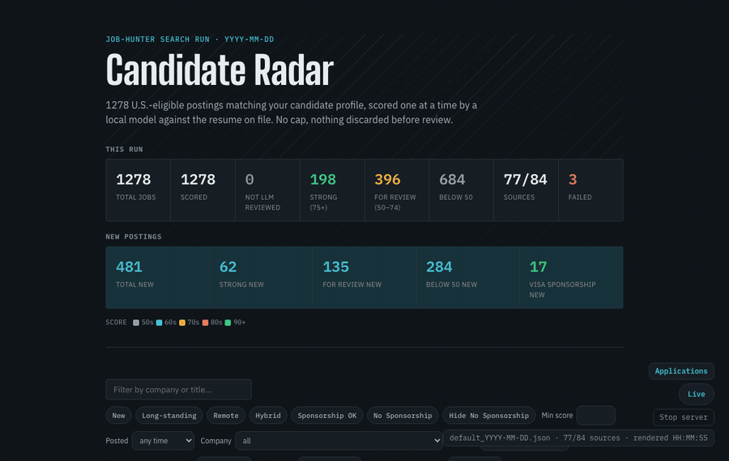
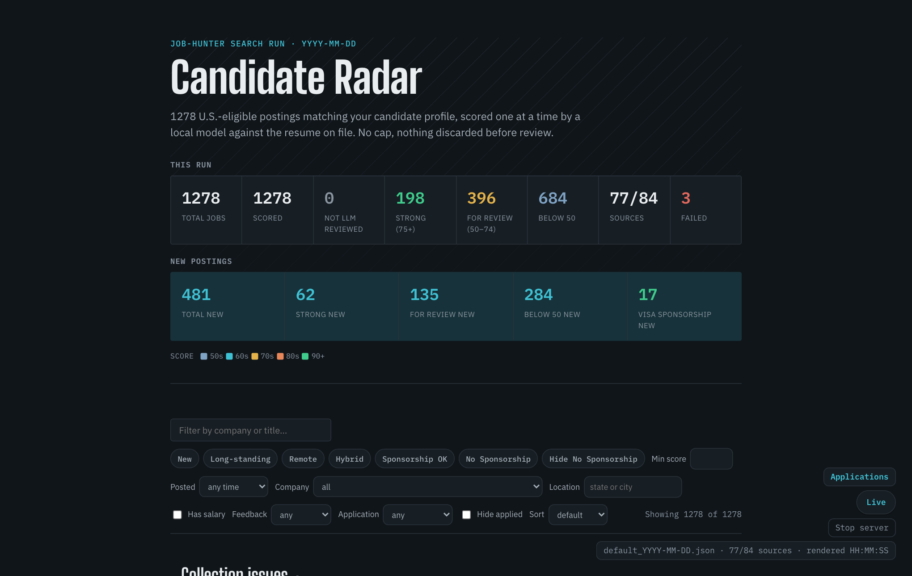
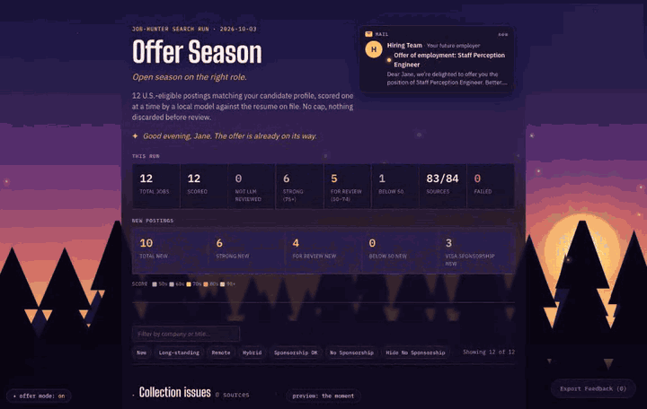
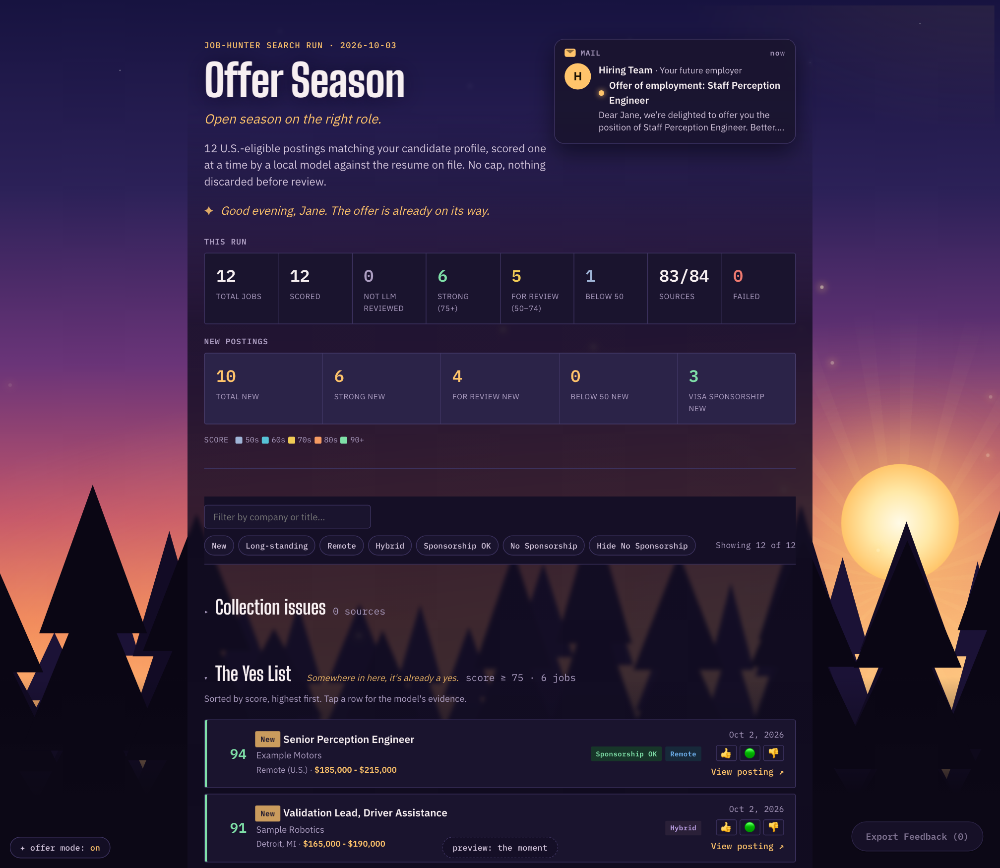
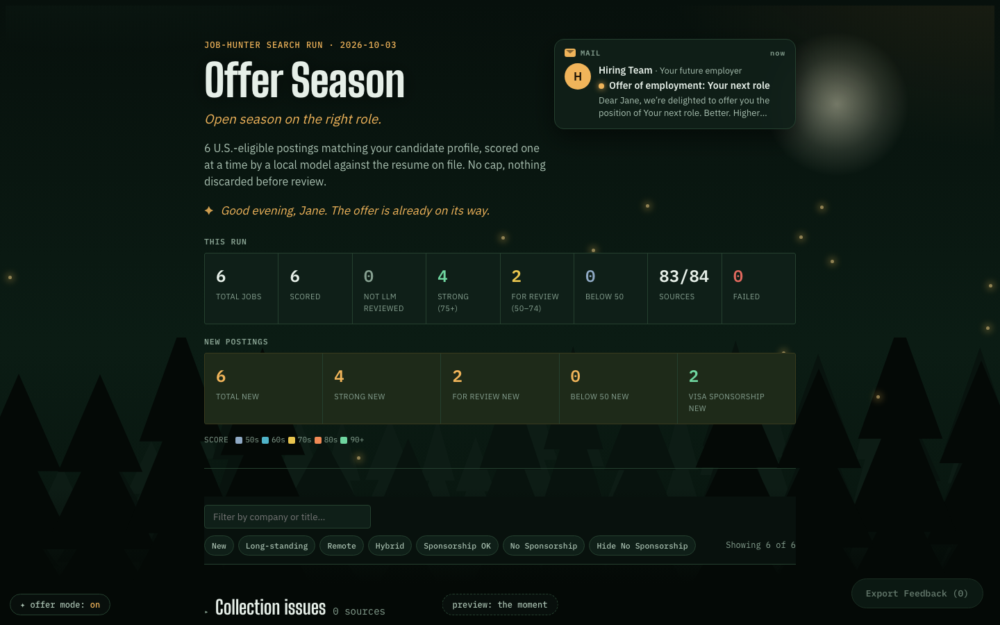
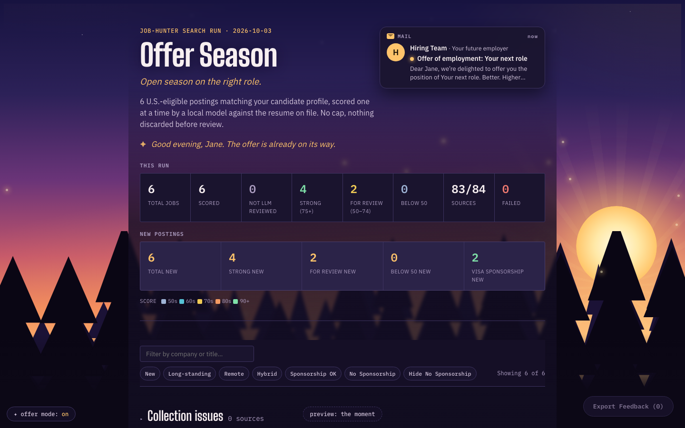

<h1 align="center">Job Hunter</h1>

<p align="center"><b>Your next job deserves a smarter search—not another thousand tabs.</b><br>
<i>84 career sites. One shortlist. Zero doomscrolling.</i></p>

<p align="center"></p>

Job boards show you everything. **Job Hunter shows you yours.**

It goes straight to employers' own career pages, drops everything that isn't a U.S.-eligible fit for
you, and lets an AI **running on your own machine** score what's left against your resume. What lands
on your screen is a single radar: ranked, filterable, and honest about why each job is there.
The screenshot below is a real run: **1,278 matching postings, 198 of them strong fits**, and not one
cloud token spent on scoring.

<p align="center"></p>

> Think of it as a recruiter who has read every careers page, never gets tired, and works only for you.
> It can't be bribed, it doesn't ghost you, and it won't send you "an exciting opportunity" in Ohio.

## Why you'll like it

- **Straight from the source.** Workday, Greenhouse, Ashby, Oracle, SuccessFactors and more: the company's own page, not a recycled repost.
- **Any company, on demand.** Not on the list? Hand Claude a careers URL and it wires the company in. [See below.](#your-list-is-just-the-start)
- **Your rules, not a black box.** A plain-text profile decides relevance and U.S. eligibility. If it rejects a job, it tells you why. Sponsorship is labelled, never used as a filter.
- **Local AI, spent wisely.** Python filters first, so your GPU only reads the shortlist, once per posting. Your wallet stays out of it.
- **A radar that remembers.** SQLite keeps jobs, scores and your 👍/🆗/👎 between runs. You see what's new and never review the same job twice.
- **Tune without re-scraping.** Preview what a profile edit would gain or lose, then rebuild the radar offline from stored data.
- **Honest about failures.** A blocked or rate-limited source gets named, and its last good jobs are kept. It never quietly shows zero.
- **Apply like you mean it.** A tailored resume, cover letter and outreach email for every role, plus application tracking and a negotiation helper. [Details below.](#found-one-apply-like-you-mean-it)

## Quickstart

Five minutes from clone to radar:

```bash
uv sync --all-extras                  # always keep --all-extras; a bare `uv sync` removes extras
uv run playwright install chromium    # once: PDF rendering for resumes
uv run scrapling install              # once: only for the two browser-based sources
cp config/candidate_profile.example.yaml config/candidate_profile.yaml   # edit your title/domain terms
cp config/settings.example.yaml config/settings.yaml                     # optional: your local settings (git-ignored)
uv run job-hunter doctor              # checks your environment and config
uv run job-hunter pipeline            # search -> local review -> radar
uv run python scripts/serve_radar.py --open   # browse it, tag jobs, track applications
```

Put your master resume at `config/resume/main_resume_<YYYY-MM-DD>.md`, and point
`config/lm_studio.yaml` (copied from `config/lm_studio.example.yaml`) at your [LM Studio](https://lmstudio.ai/) server.
Your resume and profile are git-ignored, so they never leave your machine.

## How it works

**Collect → Filter → Score locally → Explore → Give feedback → Refine**

1. **Collect** from every enabled source; one failure never stops the rest.
2. **Filter** deterministically on your profile: title and department terms, exclusions, U.S. eligibility, recency.
3. **Score** only the shortlist against your resume with your local model (cached by posting content).
4. **Explore** the radar: strong matches first, filters for remote, sponsorship, salary and recency.
5. **Feedback** tags turn into suggested profile exclusions, with a before/after preview and your approval.

Job Hunter doesn't schedule searches or apply to jobs for you. You stay the human in the loop, which is the fun part.

## Your list is just the start

**Your dream employer isn't on the list? Give Claude a URL and it becomes part of the list.**

The `onboard-source` skill is the part most people don't expect. Give it a company's careers page
and one real job link. It works out which hiring system really sits behind the page (Workday,
Greenhouse, Ashby, Oracle and a dozen more), reuses an existing adapter or writes one, tests it, checks it
against the live site, and updates the docs. No scraping knowledge needed, and no cap on how many
companies you add.

```
/onboard-source  https://example.com/careers/search   https://example.com/careers/job/12345
```

It won't fake it: a site that is bot-blocked or forbids automated collection is marked `unsupported`
with the reason, never papered over with made-up data.

## Found one? Apply like you mean it

Finding the role is half the job. Two more skills handle the rest, from your own master resume and the
saved job description.

- **`resume-generator`**: a tailored, ATS-friendly resume (or CV) as HTML and PDF, in 1, 1.5 or 2 pages, in
  your words and reordered to match the posting. Ask for the angle in plain English: "2 pages, lead with
  functional safety."
- **`outreach-writer`**: a short, warm email to the hiring manager or recruiter, and/or a tailored cover
  letter that uses the same folder and the same facts.
- **One click from the radar.** Hit **Resume** on any job: the JD is saved and a ready-to-paste prompt lands on
  your clipboard.
- **No invented facts.** Nothing is fabricated, no made-up recipient names, and nothing that contradicts your
  master resume. Your tone and per-employer preferences live in a private personalization file.

Add `salary-compare` once an offer lands, for a total-comp comparison and a negotiation script.

## Run it your way

Use the CLI directly, or drive it from an agent such as **Hermes Agent** or **Claude Code** through nine
installable skills (`sh scripts/install_skill.sh`):

| Skill | What it does |
|---|---|
| `job-hunter` | Whole pipeline in one go |
| `job-scout` / `job-reviewer` / `job-radar` | Search, score, or render on their own, and resume mid-way |
| `job-feedback` | Turn radar feedback and profile edits into a confirmed profile update |
| `resume-generator` / `outreach-writer` | Tailored resume/CV (HTML + PDF), outreach email, cover letter |
| `salary-compare` | Compare an offer to your package and draft a negotiation plan |
| `onboard-source` | Add any company from its careers URL |

## Make the hunt feel good (optional themes)

The radar can wear a forest: **`forest`** (night) or **`forest-dawn`** (sunrise), with a light
"Offer Season" layer: a daily affirmation, an **offer email** that opens like a message (with an
*Accept offer* button), and a *You got the offer* moment: when you set an application to **Offer**
a mail banner slides in first, then the celebration. It is cosmetic only: scores,
filters and data never change, and **offer mode** (bottom-left) switches the words off and
restores the plain labels.

```yaml
# config/settings.yaml (copy of config/settings.example.yaml; git-ignored)
radar:
  theme: forest-dawn   # auto (default) | forest | forest-dawn
```

One-off: `uv run python scripts/render_radar.py --theme forest`.
Personalise (all optional, in your git-ignored `config/candidate_profile.yaml`): your first name
comes from `contact.name`; set `vision:` for the role and notes, or `use_first_name: false` to keep
your name out of the pages.

On the Applications page the same themes turn the list into an *inbox*: hopeful status badges, an offer ribbon and a **Compare this offer** button that copies a `salary-compare` prompt.

<p align="center"></p>

<p align="center"></p>

<p align="center"><sub>Illustrative data (fictional companies and a placeholder name), forest-dawn theme.</sub></p>

<p align="center"> </p>

## Company coverage

84 companies are registered: 80 with working adapters and 4 explicitly unsupported (Tesla, Meta,
MathWorks, Visteon). Sources include Toyota, Honda, Ford, NVIDIA, Apple, Google, Microsoft, Rivian and
Waymo. See [`config/companies.yaml`](config/companies.yaml), and check live health with
`job-hunter source-status`.

## Go deeper

- [Usage guide](docs/USAGE.md): full setup, every command, skills, resume and salary workflows, development
- [Operations notes](docs/OPERATIONS.md): locking, timeouts, retention, archive resolution, installer and hooks
- [Architecture and functionality](docs/SPEC.md)
- [Agent skills and pipeline stages](docs/skill-split-plan.md)
- [Feedback-driven exclusion suggestions](docs/feedback-exclusion-plan.md)
- [Previewing profile changes](docs/profile-diff-plan.md)
- [`pipeline`, `--no-scrape`, and the stale-source radar fallback](docs/pipeline-refilter-stale-source-plan.md)
- [Skill frontmatter and the shared Claude/Hermes hook adapter](docs/skill-frontmatter-and-hook-plan.md)
- [Agent-runtime portability audit](docs/agent-runtime-audit.md)
