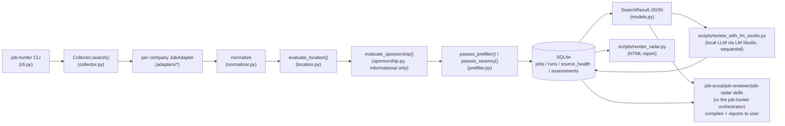

# Job Hunter — Functionality Specification

Purpose of this document: a complete, accurate reference to what the repo actually does today,
for human onboarding and for quick loading into an LLM's context (this session or a future one)
without re-deriving behavior from source. `CLAUDE.md` is contributor guidance (conventions, "why"
narratives, working rules); this document is the system description itself — what exists, how it
behaves, and every configuration/schema surface. Where the two overlap, this document is the one
kept in sync with the code; `CLAUDE.md`'s narrative callouts are cross-referenced, not repeated.

Status: reflects the repo as of 2026-09-03, **after** the skill-split described in
`skill-split-plan.md` was implemented — four independently-invocable skills
(`job-scout`/`job-reviewer`/`job-radar`/`job-hunter` orchestrator), the `search_archive.py`
resolver, and `review_with_lm_studio.py --status`. Section 11 below reflects this current state.
This document also absorbed the operational/discovery detail that used to live in `README.md`
(per-source posted-date mechanisms and caveats, adapter-specific tradeoffs, measured performance
numbers, adapter config keys) — `README.md` was trimmed to setup/commands/skills/installation only
and now points here for everything else.

---

## 1. Purpose and scope

Job Hunter is a manual, config-driven collector for employer career sites. Given a candidate
profile (or ad-hoc keywords), it:

1. Fetches current job listings from ~21 configured employer career sites.
2. Normalizes them into a common schema.
3. Applies a strict, deterministic U.S.-eligibility location filter.
4. Applies a deterministic title/department relevance prefilter and a recency filter.
5. Persists everything to SQLite (history, dedup, source health).
6. Emits a JSON candidate bundle.
7. Scores each candidate against a resume using a **local** LLM (LM Studio) — no cloud/agent
   tokens spent on scoring.
8. Renders results as a text summary and a standalone HTML "radar" report.

**Non-goals:** it does not schedule itself, does not apply to jobs, does not use cloud LLM tokens
for scoring, and does not add credential/session-based scraping workarounds. The one deliberate
exception to "plain HTTP only" is the `stealth_html` adapter (§5.3).

---

## 2. Architecture overview



**Division of responsibility:** Python owns networking, normalization, persistence, health, and
location/recency/relevance filtering. Scoring against a resume is delegated to a local model via a
deterministic script, never to Python logic and never to cloud LLM tokens. The agent skill layer
owns only: invoking the right commands in order, and compiling/reporting already-computed results
to the user in natural language — it never re-derives a score or filtering decision itself.

---

## 3. Configuration

Three YAML files, each loaded and validated with pydantic models in `config.py`.

### 3.1 `config/settings.yaml` → `Settings`

| Field | Type / default | Meaning |
|---|---|---|
| `database_path` | `data/jobs.sqlite3` | SQLite file location |
| `collection.max_concurrent_sources` | int, default 3 | concurrent company fetches |
| `collection.max_concurrent_details` | int, default 8 | concurrent detail fetches *within* one source |
| `collection.max_connections` / `max_keepalive_connections` | 6 / 3 | httpx connection pool tuning |
| `collection.timeout_seconds` | 30 | per-request timeout |
| `collection.max_retries` | 3 | retry-with-backoff attempts (429/500/502/503/504 + network/timeout) |
| `search.country` | `"US"` (fixed) | eligibility target |
| `search.include_work_arrangements` | onsite/hybrid/remote/unknown | which arrangements are acceptable |
| `search.max_posting_age_days` | 30 | recency cutoff, see §7.4 |
| `recommendation.minimum_score` | 75 | default recommendation threshold (profile can override) |

### 3.2 `config/companies.yaml` → `CompaniesFile` (list of `CompanyConfig`)

Each entry: `key`, `company` (display name), `enabled`, `adapter` (one of §5.1's registered
names), optional `platform` label, an adapter-specific `config` dict, and `unsupported_reason`
(**required** by a model validator whenever `adapter: unsupported` — enforced, not a convention).
Keys must be unique (also enforced by a validator).

### 3.3 `config/candidate_profile.yaml` → `CandidateProfile`

| Field | Type / default | Meaning |
|---|---|---|
| `resume_path` | path or none | resume file read fresh at review time (see §8.4) |
| `target_domains` | list[str] | positive-match terms (domain-level, e.g. "ADAS") |
| `target_title_terms` | list[str] | positive-match terms (title-level, e.g. "Product Manager") |
| `exclude_title_terms` | list[str], default `["intern", "co-op"]` | hard exclude, title only |
| `exclude_terms` | list[str] | hard exclude, full description text |
| `minimum_recommendation_score` | int, default 75 | threshold passed into the LLM prompt as `recommended` |
| `location` | dict | reserved for future location-preference config (unused by current filters beyond eligibility) |

Falls back to `candidate_profile.example.yaml` if the real file doesn't exist — every command that
loads a profile behaves this way, not just search.

### 3.4 Adapter config keys (the `config` dict inside a `companies.yaml` entry)

JSON adapters (`ConfigurableJsonAdapter` and its subclasses) accept: `list_url`, `method`,
optional `payload`/`params`; `items_path` (dot-separated path to the posting list); `fields`
(maps normalized names — `id`, `title`, `url`, `location`, `city`, `state`, `country`,
`department`, `employment_type`, `posted_at` — to response paths); `detail_base_url`,
`listing_description_path`, or `detail_description_path`; Oracle HCM's `paginate: true` +
`total_path` (§5.1); the opt-in `public_url_template` (§5.4).

HTML adapters accept: `list_url`, `card_selector`, `link_selector`, `title_selector`,
`location_selector`, `id_attribute`, `next_selector`, `page_parameter`/`page_size` (row-offset
pagination) or `page_number_parameter` (1-indexed page-number pagination), `posted_at_selector`
(parsed via `normalizer.parse_display_date`, e.g. `"Aug 10, 2026"`), `description_selector`.
`html_multi_index` additionally accepts `index_urls`. `stealth_html` accepts every
`html_paginated` key plus `wait_selector`.

Use `scripts/endpoint_probe.py` (or curl) during development to inspect a candidate endpoint
before writing config for it — never hand-invent an endpoint shape (§5.12).

---

## 4. Data model (`models.py`)

```
JobSummary          — listing-page fields only (source_key, job_id, title, url, location_raw,
                       city/state/country, work_arrangement, department, employment_type,
                       posted_at, raw dict excluded from serialization)
JobDetail            — detail-page fields (description, salary_min/max/currency, overrides for
                       location/work_arrangement/department/employment_type/posted_at)
Job(JobSummary)      — the full record: us_eligible, location_confidence/evidence,
                       visa_sponsorship/sponsorship_evidence, description, salary fields,
                       first_seen_at/last_seen_at, content_hash, is_new, is_changed,
                       prior_assessment
Assessment           — source_key, job_id, company, title, url, content_hash, score (0-100),
                       recommended (bool), matches (2-4 strings), gaps (1-3 strings),
                       resume_path, assessed_at
SourceHealth          — source_key, company, status (ok/warning/failed/unsupported), job_count,
                       message, error_type, attempted_at
SearchSummary          — sources_attempted/succeeded/failed, jobs_observed, us_eligible,
                       prefilter_candidates, stale_excluded, partial_failure
SearchResult            — run (RunInfo), summary, source_health[], candidates: list[Job]
```

`content_hash` is the linchpin of caching everywhere in the system (§8.4): computed per job from
its normalized content, it's how `is_changed` is detected on upsert and how a stored `Assessment`
is judged still valid.

---

## 5. Adapters (`adapters/`)

### 5.1 Registered adapter types (`adapters/__init__.py`'s `ADAPTERS` dict)

| Adapter key | Class | Notes |
|---|---|---|
| `workday` | `WorkdayAdapter` | Workday CXS JSON API |
| `successfactors_rmk` | `SuccessFactorsRmkAdapter` | SAP SuccessFactors career-site JSON |
| `lever` | `LeverAdapter` | Lever public JSON API |
| `oracle_hcm` | `OracleHcmAdapter` | Oracle HCM REST, subclasses `json_api.ConfigurableJsonAdapter` with pagination (`config: {paginate: true, total_path: ...}`) |
| `phenom` | `PhenomAdapter` | Phenom People career-site JSON |
| `html_paginated` | `HtmlPaginatedAdapter` | generic CSS-selector-driven HTML pagination, always also checks schema.org JobPosting JSON-LD in `fetch_detail` |
| `html_multi_index` | `HtmlMultiIndexAdapter` | HRI-specific: adds a Liferay DDM `JobOfferData` inline-JS date fallback on top of `html_paginated`'s JSON-LD check |
| `discovered_api` | `DiscoveredApiAdapter` | generic config-driven JSON kernel for a hand-probed endpoint that doesn't fit another named platform |
| `stealth_html` | `StealthHtmlAdapter` | real headless browser (Scrapling `AsyncStealthySession`) — see §5.3, the one deliberate exception to plain HTTP |
| `adp_recruiting` | `AdpRecruitingAdapter` | ADP Recruiting Management two-call handshake (unauthenticated `myJobsToken` fetch replayed as a header on a paginated listing endpoint) |
| `apple` | `AppleAdapter` | parses `window.__staticRouterHydrationData` JSON embedded in jobs.apple.com's server-rendered React Router SPA HTML |
| `unsupported` | `UnsupportedAdapter` | explicit "no viable path" marker; `unsupported_reason` required |

`json_api.ConfigurableJsonAdapter` (not directly registered, but the base several of the above
subclass) is a generic JSON-listing kernel driven entirely by `companies.yaml` config
(`list_url`, `items_path`, `fields` mapping, optional `public_url_template` for a
human-openable URL distinct from the scraping endpoint).

All adapters inherit `JobAdapter` (`adapters/base.py`), which supplies retry-with-backoff HTTP
(`request()`), and a default `healthcheck()`. Adapters implement `fetch_summaries()` (required)
and optionally `fetch_detail()`.

### 5.2 Currently configured companies (24, `config/companies.yaml`)

Live, current numbers: `uv run job-hunter source-status`. **Every row is deterministic Python —
none of it runs an LLM**; collection always executes as plain `asyncio`/httpx/selectolax(/Scrapling)
code, identically on every run. The only LLM involvement anywhere in the system is later and
separate: `job-reviewer` scoring the JSON output against a resume — it reads this data, it doesn't
produce it. Getting a *new* source working still takes one-time reverse-engineering (§5.12), but
that's a cost paid once per company, not per search.

| Key | Company | Adapter | Posted date | Tools used |
|---|---|---|---|---|
| honda | American Honda Motor Co. | phenom | Yes (`postedDate`/`datePosted`, exact — the two disagree, see §5.7) | httpx only — embedded SEO JSON + JSON-LD; real pagination params are `from`/`s`, not the commonly-guessed `start`/`num` |
| toyota | Toyota Motor North America | workday | Yes (`startDate`) | httpx only (Workday native JSON API) |
| gm | General Motors | workday | Yes (`postedOn`/`startDate`) | httpx only — public unauthenticated Workday CXS API, no bot protection; `stealth_html` was dropped entirely once this was found |
| ford | Ford Motor Company | oracle_hcm | Yes (`PostedDate`) | httpx only — Oracle HCM public REST, offset-paginated, ~824 jobs |
| stellantis | Stellantis | adp_recruiting | Yes (`postingDate`) | httpx only — ADP Recruiting Management public two-call handshake, ~1,006 requisitions (§5.10) |
| nissan | Nissan | workday | Yes (`startDate`) | httpx only (Workday) |
| volkswagen | Volkswagen Group of America | successfactors_rmk | Yes (`td.colDate span.jobDate`) | httpx + selectolax |
| tesla | Tesla | **unsupported** | n/a | Akamai edge "Access Denied" — see §5.7 |
| paccar | PACCAR | successfactors_rmk | Yes (`td.colDate span.jobDate`) | httpx + selectolax |
| valeo | Valeo | workday | Yes (`startDate`) | httpx only |
| denso | DENSO | oracle_hcm | Yes (`PostedDate`) | httpx only |
| astemo | Astemo | stealth_html | Yes (JobPosting JSON-LD `datePosted`) | Scrapling stealth browser + selectolax — Cloudflare Turnstile, no unprotected backend found yet |
| hri | Honda Research Institute USA | html_multi_index | Yes — Liferay `JobOfferData` fallback (§5.5) | httpx + selectolax |
| tri | Toyota Research Institute | lever | Yes (`createdAt`) | httpx only (Lever public API) |
| mbrdna | Mercedes-Benz R&D North America | lever | Yes (`createdAt`) | httpx only |
| woven | Woven by Toyota | lever | Yes (`createdAt`) | httpx only — Next.js front end over the same public Lever API (§5.7) |
| hma | Hyundai Motor America | successfactors_rmk | Yes (`td.colDate span.jobDate`) | httpx + selectolax |
| apple | Apple | apple | Yes (`postDateInGMT`) | httpx only — React Router SSR JSON (§5.9) |
| google | Google | stealth_html | No | Scrapling stealth browser + selectolax — not bot-blocked, JS-only "boq-hiring" frontend with Closure-hashed CSS classes (fragile across a redesign) |
| waymo | Waymo | html_paginated | Conditional — JobPosting JSON-LD when not WAF-challenged (§5.7) | httpx + selectolax, rate-sensitive |
| hatci | Hyundai America Technical Center | successfactors_rmk | Yes (`td.colDate span.jobDate`) | httpx + selectolax |
| caterpillar | Caterpillar | workday | Yes (`startDate`) | httpx only — public unauthenticated Workday CXS API (~982 jobs), same fix as GM (`careers.caterpillar.com` is only the marketing front end); a first-time full-catalog `--refresh-details` run has been observed to hit 429s from Workday's shared host under this project's default detail-fetch concurrency — same known caveat GM's entry already carries, see §5.7 |
| nvidia | NVIDIA | workday | Yes (`startDate`) | httpx only — public unauthenticated Workday CXS API, ~2,000 jobs visible (real catalog ~2,697 per facet counts; this tenant's search hard-caps at 2,000, see §5.7); rate-limits reproducibly even on a normal (non-`--refresh-details`) run, worse than GM/Caterpillar — see §5.7 |
| deere | Deere & Company | eightfold | Yes (`postedTs`) | httpx only — Eightfold's public "pcsx" API (`/api/pcsx/search` + `/api/pcsx/position_details`), found by rendering the JS-only listing once and reading its real XHR calls, not guessed (§5.11); ~99 US jobs, no rate-limit issues observed at this catalog size |

Adapter mix: workday ×6, successfactors_rmk ×4, lever ×3, stealth_html ×2, oracle_hcm ×2,
1 each of unsupported/phenom/html_paginated/html_multi_index/apple/adp_recruiting/eightfold.
Every `unsupported` entry carries a specific `unsupported_reason` in `config/companies.yaml`.
Active/closed detection is presence-only for every source, including ones with a posted date —
see §5.6.

### 5.3 The `stealth_html` adapter — the one deliberate exception

Every other adapter is plain `httpx`. `stealth_html` drives a real headless stealth browser
(Scrapling) only for a source with no viable anonymous endpoint — either active bot-blocking
(astemo: Cloudflare Turnstile) or content that genuinely doesn't exist until client-side JS runs
(google). This is a disclosed, deliberate choice to defeat a site's own anti-automation controls —
real ToS exposure, not "just reading public data." Before reaching for it, the established
practice (proven repeatedly — GM, Stellantis, Apple all looked like they needed it and didn't) is
to check for an unprotected backend API first. Requires the optional `stealth` extra (`uv sync
--extra stealth && uv run scrapling install`), not installed by default.

### 5.4 The "scraping endpoint ≠ human-openable URL" trap

Some public JSON APIs (GM/Ford/DENSO's) are great for `fetch_summaries`/`fetch_detail` but just
dump JSON if a human opens them directly. `workday.py`'s `fetch_detail` reconstructs the CXS API
URL independently so `public_base_url` can point at Workday's real candidate-facing host instead;
`json_api.py` gained an opt-in `public_url_template` (Ford/DENSO) for the same reason, verified via
curl against the real rendered page — never guessed.

### 5.5 Posted-date mechanisms

Three independent mechanisms feed a posting date, in order of coverage:

1. **Per-field config** — direct field mapping per adapter/company (§5.2's table): Workday's
   `startDate`/`postedOn`, Oracle HCM's `PostedDate`, Lever's `createdAt`, Phenom's
   `postedDate`/`datePosted`, ADP RM's `postingDate`, Apple's `postDateInGMT` (parsed straight from
   its SSR JSON, §5.9), Eightfold's `postedTs` (epoch seconds, listing-level — confirmed against
   Deere's sample job to match its detail page's JSON-LD `datePosted` exactly, distinct from a
   separate `creationTs` field on the same record that is *not* the same value), and the four
   `successfactors_rmk` sites' shared `posted_at_selector: td.colDate span.jobDate` (via
   `normalizer.parse_display_date`).
2. **Generic schema.org JSON-LD fallback** — `html_paginated.py`'s `fetch_detail` always checks
   for a JobPosting JSON-LD block (`normalizer.extract_job_posting_ld`) regardless of adapter
   config, using its `datePosted`/`employmentType` without overriding a description a
   `description_selector` already found. This is what covers Astemo (no per-field config exists
   for it) and conditionally Waymo (present only when its AWS WAF challenge isn't currently
   blocking the fetch — §5.7). The regex matches `type="application/ld+json"` anywhere in the
   `<script>` tag's attributes, not only immediately after `<script `, since Astemo's markup puts
   another attribute first.
3. **Liferay DDM `JobOfferData` fallback (HRI only)** — HRI's Liferay-backed detail pages carry no
   JSON-LD; `html_multi_index.py`'s `fetch_detail` override
   (`normalizer.parse_liferay_publication_date`) parses an inline `JobOfferData` JS object's
   `publicationDate` (`"Mon D, YYYY H:MM:SS AM/PM"`) whenever the JSON-LD check finds nothing —
   the same value the site itself emails back on application confirmation, i.e. its own
   authoritative publish date. This flows into `passes_recency` with **no per-company exemption** —
   a deliberate choice: verified live, HRI's currently-listed postings are mostly well past the
   30-day cutoff, so most of its jobs filter out as stale rather than being kept for lack of a
   determinable date (the previous behavior, before this extraction existed).

Google is the one working source with no date signal via any of these three mechanisms — confirmed
by direct testing, not assumed.

### 5.6 Active/closed detection — presence-only, by design

No source — including ones with a posted date — exposes an explicit filled/closed/still-hiring
field in its public listing data. Confirmed directly: Honda job 11824 ("Principal ADAS Development
Engineer") was still listed live on Honda's own site despite having gone through an interview for
it. The only remotely-related field is Phenom's `externalApply: false`, whose exact meaning is
unconfirmed. The only signal any public scraper (this tool included) can ever have is "is this job
still present in the site's current listing" — `storage.py`'s `mark_missing()` already tracks
exactly this: a job is `closed` after 3 consecutive healthy runs where it's absent (§8.1). This
status isn't in the main `search` JSON output, only via `db-stats`/`export` (direct SQLite
queries) — and it can only ever be as current as the employer's own site.

**A specific trap already found and avoided:** don't detect "closed" by string-matching a phrase
like "no longer accepting applications" against a *plain* (non-JS) HTML fetch. Honda job 11824's
static HTML contains that exact phrase inside a generic Phenom template component
(`data-component="card-description"`) present on *every* job page's markup regardless of real
status — meant to be shown/hidden by client-side JS depending on whether the job's own API call
resolves. A JS-capable render made the text disappear, replaced by the real title/description and
a working Apply button. A closed-detection heuristic built on static markup alone would
false-positive here.

### 5.7 Known per-source caveats

- **Honda's two date fields disagree.** Phenom exposes a posting date in two places that aren't
  the same value for the same job — the listing page's embedded SEO JSON (`postedDate`, used by
  `fetch_summaries`) and the detail page's JSON-LD (`datePosted`, used by `fetch_detail`). Verified
  against job 11221 on 2026-08-30: listing `postedDate` = `2026-08-19` (a stable original date);
  detail JSON-LD `datePosted` = `2026-08-30` (*today*, at the moment of checking) — behaving like a
  "last shown active"/republish timestamp, not a stable original-post date. Because `collector.py`
  only refetches detail when a job has no prior stored description, most previously-seen Honda jobs
  keep the more stable listing-level `postedDate`; a `--refresh-details` run would start picking up
  JSON-LD's drifting value instead. Prefer the listing's `postedDate` if this date is ever more
  actively relied upon (e.g. a tighter recency cutoff).
- **Waymo is rate-sensitive.** An AWS WAF JS-execution challenge sits in front of the whole site
  and escalates with request volume — confirmed to return an empty HTTP 202 to both curl and httpx
  once triggered (listing and detail alike), while a JS-capable fetch (Scrapling) passes reliably.
  Retest with `source-test` rather than assuming a failed run means the source is broken.
- **Tesla is unsupported, not merely rate-limited.** An Akamai edge-level "Access Denied"
  (`errors.edgesuite.net`) held even with `stealth_html`'s fingerprint spoofing (both
  `AsyncStealthySession` and `AsyncDynamicSession` tried) — this looks like an IP/ASN-reputation
  block, not a JS challenge, which `stealth_html` cannot solve. Getting past it would need a
  residential proxy, a step not taken without a separate explicit decision to do so.
- **Woven by Toyota's Next.js front end** (`woven.toyota/en/careers/`) is a thin layer over the
  same public Lever API used by TRI/MBRDNA — confirmed by matching a real detail-page posting's
  UUID job ID exactly against `jobs.lever.co/woven-by-toyota/<id>`.
- **Large Workday tenants can 429 under a first-time full-catalog detail fetch.** GM and
  Caterpillar's shared Workday CXS hosts have both been observed returning 429 (and GM, separately,
  403) mid-run when `collector.py` fetches details for every job concurrently (bounded only by
  `max_concurrent_details`, default 8) — most likely on the very first ingest of a large tenant
  (~800-1,000 jobs), where every job is new and needs a detail fetch at once. `asyncio.gather`
  without `return_exceptions=True` means one such failure fails the whole company for that run
  (`source_health` shows `FAILED`, zero jobs persisted) even though the summaries fetch and most
  detail fetches succeeded — this is a collection-pipeline concurrency behavior, not specific to
  either adapter config, and retrying the same run (letting Workday's rate-limit window pass) has
  been the practical workaround so far rather than a code fix. **NVIDIA's tenant is worse: even the
  normal recency-skip path (no `--refresh-details`) 429s, reproducibly, across multiple attempts.**
  Confirmed live: of NVIDIA's 2,000 open postings, 1,206 fall inside the default 30-day recency
  window and still need a detail fetch each — the recency-skip only trims total volume by ~40%,
  not nearly enough to stay under this tenant's throttle at 8 concurrent requests. Neither
  `--keyword` nor any other CLI flag helps here: `passes_prefilter` (which `--keyword` feeds into)
  runs in `Collector.search()` only *after* `_collect_source()` has already fetched every summary
  and detail for every company — it filters the in-memory result, never reduces the network calls
  themselves. Onboarding NVIDIA is otherwise complete and verified (adapter/config confirmed
  correct by exercising it directly, sample job/date/location/sponsorship all match), but a full
  `job-hunter search --companies nvidia` run should be expected to need a few retries before it
  succeeds end-to-end until this is addressed (lowering `max_concurrent_details` globally, or
  making `_detail_for` resilient to a single 429 instead of failing the whole company, are the
  two real fixes — neither attempted here, as both are collector-wide changes outside a single
  source's onboarding).

### 5.8 `stealth_html` tradeoffs

Setup (opt-in, not installed by default):
```bash
uv sync --extra stealth
uv run scrapling install
```

- **ToS exposure** applies only to `astemo` (actually bot-blocked by Cloudflare Turnstile) — real
  anti-bot circumvention, independent of personal/non-commercial intent. `google` isn't defended
  by anything; using a browser there is a rendering necessity (its JS-only frontend), not
  circumvention.
- **Per-request cost:** each fetch is a real browser page load (~1-2s), not a lightweight HTTP
  call — detail fetches are concurrent within a source (bounded by `max_concurrent_details`) but a
  large source can still take a while end-to-end.
- **Not a universal fix — always worth checking for an unprotected backend first.** GM looked
  identical to Astemo (same Cloudflare challenge, same Findly-branded platform) until a real job
  link showed its real backend was an unprotected public Workday API — it no longer uses this
  adapter at all. It also does not solve Tesla's Akamai block (a different, network-level problem).
- **ARM64/Raspberry Pi:** not run on a Pi from the development environment (macOS); Scrapling's
  browser binary has Linux ARM64 builds and should run headless on a Pi 4/5, but expect slower
  launches/higher memory pressure — validate directly (`uv run job-hunter source-test gm`) before
  relying on it; lower `max_pages` or run one company at a time (`--companies gm`) if it hangs or
  gets OOM-killed.
- **Scrapling's bundled MCP server** (`scrapling mcp`) is unrelated to this project's own use —
  job-hunter calls Scrapling's Python API directly (`AsyncStealthySession`/`AsyncDynamicSession`),
  never through MCP. If an `mcp__ScraplingServer__*` tool call appears elsewhere in a session,
  that's the same underlying package reached through its own separate MCP interface, not something
  this repo's commands invoke. `uv sync --extra stealth` already installs everything job-hunter
  itself needs; running Scrapling's MCP server standalone is a separate, unrelated action.

### 5.9 The `apple` adapter's SSR-JSON parsing

jobs.apple.com's React Router SPA server-renders every page (search results and job detail alike)
with a full JSON snapshot embedded as `window.__staticRouterHydrationData = JSON.parse("...")`.
The argument is double-encoded — the outer JS string-literal escaping must be undone with one
parse before the inner text is itself valid JSON — but needs no browser: a plain GET returns exact
posting dates (`postDateInGMT`), full descriptions, and structured locations, both for the
paginated search endpoint (`?location=united-states-USA&page=N`, 20/page, ~4,537 U.S. postings)
and each job's detail page. A real bug caught during development: httpx's `params=` *replaces* a
URL's existing query string rather than merging with it — passing `page` as a bare `params` dict
against a `list_url` that already carries `?location=...` silently dropped the location filter and
pulled Apple's entire global listing instead (caught because the resulting count, 4,999 =
`page_size × max_pages`, was suspiciously round rather than the real ~4,537). Fixed by merging the
URL's own query string with `page` explicitly before each request.

### 5.10 The `adp_recruiting` adapter's token handshake

Stellantis's Angular SPA front end (`myjobs.adp.com/{career_site_domain}/cx/...`) never renders
content server-side. The real backing calls, found by rendering the page once through a browser to
read its own generated XHR calls: a public, unauthenticated `GET
/public/staffing/v1/career-site/{domain}` returns a `myJobsToken`, replayed by the same front end
as a `myjobstoken` request header on `GET .../job-requisitions/apply-custom-filters` — no login,
cookies, or session/CSRF replay, just a two-step public handshake any anonymous browser performs.
That listing endpoint supports real `$top`/`$skip` OData pagination (capped between 200-500
rows/page — `$top=500` returns a 502, `$top=100` is the configured default) and returns each
requisition's full description, qualifications, and `postingDate` in one shot, so no separate
per-job detail fetch is needed. A future ADP RM customer should generalize to this adapter via
`career_site_domain` config alone.

### 5.11 The `eightfold` adapter and finding it via network-capture

Deere's careers site (`careers.deere.com/careers?query=...`) is Eightfold-branded (`_EF_GROUP_ID`/
`_EF_PRODUCT` globals, `static.vscdn.net` CDN) and, unlike every other source in this project so
far, renders **zero** job data server-side on its listing page — not JS-only-but-scrapable, not a
hydration blob, nothing in the raw HTML at all. Guessing a plausible-looking Eightfold path from
general platform familiarity (`/api/apply/v2/jobs`) returned a same-shaped-but-wrong 403
`{"message": "Not authorized for PCSX"}` — a real response, just the wrong endpoint; the "PCSX" in
that error is what pointed at the actual path. The real one was found by rendering the listing page
once with Playwright and reading its own XHR/fetch calls: a plain, unauthenticated `GET
/api/pcsx/search?domain={group_id}&location=...` for the list and `GET
/api/pcsx/position_details?position_id={id}&domain={group_id}` for the detail — both confirmed to
need no cookies or session at all (tested cold, no prior page load). Pagination via `start` is
real (confirmed: different jobs at start=0/10/20) but the page size is fixed server-side at 10 —
every override tried (`num`, `limit`, `size`, `pageSize`, `per_page`) was silently ignored, so
`EightfoldAdapter.fetch_summaries()` (`adapters/eightfold.py`) loops in strides of whatever the
server actually returned until `data.count` (confirmed stable regardless of those ignored params)
is reached, rather than assuming any particular stride. `postedTs` (epoch seconds) was cross-checked
against the sample job's detail-page JSON-LD `datePosted` and matched exactly; a separate
`creationTs` field on the same record is *not* the same value (confirmed different, ~11 days
earlier) and is not used. `location=united states`/`filter_include_remote=1` are passed as
server-side params (same ones the sample URLs already used) purely to shrink the fetched catalog
(226 global → 99 US) — no `query` keyword param is ever passed, since keyword scoping is this
project's own `passes_prefilter`/`--keyword`, never an adapter's job (see this file's top-level
division-of-responsibility note). A future Eightfold-powered customer should generalize to this
adapter via config alone, substituting `domain`/`list_url`/`detail_url` — the "guess the path,
watch it fail informatively, then network-capture the real one" sequence here is the reusable
lesson, not any specific path string.

### 5.12 Adding a new source

A one-time reverse-engineering step, not something that happens on every search: fetch the plain
page (`scripts/endpoint_probe.py` or curl) to check for a real JSON API or clean static HTML
first; if the site needs a browser (JS-rendered, or bot-blocked), render it once with Scrapling to
find the real card/pagination/description selectors; write the result as a static
`config/companies.yaml` entry (or, rarely, new adapter code); verify with `uv run job-hunter
source-test <key>`. From then on every future search runs the same deterministic code — no further
discovery or LLM involvement needed unless the site's markup changes.

This whole process is encoded as the **`onboard-source`** project skill
(`.claude/skills/onboard-source` — separate from the four job-hunter skills in §11): given a
company name, its careers listing URL, and one sample job URL, it discovers the real backing
system, wires up (or writes) an adapter, tests it, verifies it live, and updates
`README.md`/`CLAUDE.md`. See its discovery playbook
(`.claude/skills/onboard-source/references/discovery-playbook.md`) for known ATS/platform
signatures (Workday, Oracle HCM, Lever, Phenom, SuccessFactors, ADP RM, Next.js/Nuxt/React Router
hydration data, JSON-LD, Liferay DDM) and probing techniques.

---

## 6. Collection pipeline (`collector.py`)

`Collector.search(include_seen, new_only, refresh_details, max_candidates, keywords)`:

1. Fetches all enabled companies **concurrently**, bounded by `max_concurrent_sources`.
2. Within each source, fetches detail pages **concurrently**, bounded by `max_concurrent_details`
   — but only when needed: no prior record, prior has no description, or `--refresh-details`.
3. A job whose *listing-level* `posted_at` already proves it's older than
   `max_posting_age_days` skips its detail fetch entirely (`is_recent()`, §7.4) — this is what
   makes large full-catalog sources (Apple, Ford, Stellantis) tractable.
4. Re-evaluates location using detail data — a detail page can override an ambiguous/remote
   summary location.
5. Upserts into `Storage` (dedup, `is_new`/`is_changed` via `content_hash`).
6. One source's failure never aborts other sources — caught per-company, turned into a
   `FAILED`/`UNSUPPORTED` `SourceHealth` entry. CLI exits non-zero only if *all* attempted sources
   failed.
7. Some sources (Apple, Stellantis: confirmed sorted newest-first) stop *paginating* early once
   postings are provably stale; Ford/DENSO's Oracle HCM listing is *not* reliably date-sorted, so
   it always fetches its full catalog. `mark_missing`'s `stale_before` parameter prevents an
   early-pagination-stop source from falsely marking jobs "closed" just because it stopped looking
   for them.
8. `health.py`'s `detect_count_anomaly` flags (never fails) a source whose job count drops >70%
   from its last known count.

---

## 7. Filtering pipeline, in order

### 7.1 Location eligibility (`location.py`'s `evaluate_location`)

Returns `LocationDecision` (`us_eligible`, `confidence`, human-readable `evidence`). Precedence,
in order: structured country/state fields → explicit "remote in the U.S." phrasing → U.S. state
name/abbreviation → explicit "United States" text → recognized non-U.S. country/city list → bare
"remote" with no U.S. evidence rejected as low-confidence. Ordering exists specifically to avoid
wrongly excluding/including multi-location or ambiguous-remote postings.

### 7.2 Sponsorship detection (`sponsorship.py`'s `evaluate_sponsorship`) — informational only

Same deterministic-detection pattern as location, but **never a filter** — `passes_prefilter`
never calls it. Sets `Job.visa_sponsorship` to `available`/`not_available`/`unmentioned` plus
`sponsorship_evidence`. Uses a curated phrase list (not a bare `"sponsor"` substring — confirmed
false positives on PACCAR/Hyundai/Valeo copy). Not-available phrases checked before available ones
(so "GM DOES NOT PROVIDE...SPONSORSHIP" can't be miscounted). Descriptions are stripped of HTML
tags before matching. Defaults to `unmentioned` when nothing matches.

`job-hunter reevaluate-sponsorship` re-runs this against every stored job's existing description,
no network — used after a phrase-list change, or to backfill jobs whose source was failing when
`visa_sponsorship` was added.

### 7.3 Prefilter (`prefilter.py`'s `passes_prefilter`)

Order of checks:
1. `job.us_eligible` must be true.
2. `exclude_title_terms` checked against `title` only.
3. `exclude_terms` checked against the **full** `title + department + description` text.
4. Positive match — `keywords` (from `--keyword`) if given, else
   `target_title_terms + target_domains` — checked against **title + department only, never
   description**. This is deliberate: full-description matching let boilerplate/optional-bullet
   text inject an irrelevant target term (confirmed on live postings). `department` stays in scope
   because it's curated structured metadata, not marketing prose.
5. A keyword search only ever *narrows* — exclude terms and U.S. eligibility still apply on top.

`relevance_score` is a cheap keyword-count heuristic used only for ordering, never gating — final
semantic scoring is always the LLM review step.

There is **no default candidate cap** — `--max-candidates` is an explicit opt-in. (There used to
be an automatic 3×-recommendation-count cap; removed once the title/department-scoped prefilter
brought typical U.S.-eligible match counts down from ~3,100+ to ~50-150/day, small enough for full
sequential local-LLM review.)

Candidates are sorted **newest-first** (not by `relevance_score`), so an interrupted review has
already covered the freshest postings.

### 7.4 Recency (`prefilter.py`'s `passes_recency` / `is_recent`)

Deterministic, no LLM: excludes a job whose known `posted_at` is older than
`search.max_posting_age_days` (default 30). A job with **no** discoverable `posted_at` is kept,
not excluded — its age can't be determined, and dropping it would look identical to a source
outage.

---

## 8. Persistence (`storage.py`) — SQLite, WAL mode

### 8.1 `jobs` — one row per `(source_key, job_id)`

Full normalized record (title, location fields, `us_eligible`, `location_confidence/evidence`,
`visa_sponsorship`/`sponsorship_evidence`, department, description, salary fields, `content_hash`,
`first_seen_at`, `last_seen_at`, `status` [`active`/`closed`], `missing_count`). Upserted with
`is_new`/`is_changed` computed from the prior row's `content_hash`. A job is marked `closed` after
3 consecutive runs missing from a healthy source's listing (`mark_missing`); it stays `active`
otherwise — this is why previously-seen jobs surface by default (`--new-only` filters output, not
collection).

### 8.2 `runs` — one row per search invocation

`run_id`, `started_at`/`completed_at`, `status`, `sources_attempted/succeeded`, `jobs_observed`,
`candidates_returned`. **Does not** record `keyword` or an archive file path — see
`skill-split-plan.md` §4 for why archive-file resolution is done via filesystem globbing instead
of an index table.

### 8.3 `source_health` — one row per source, rolling status

`last_attempt_at`, `last_success_at`, `last_job_count`, `consecutive_failures`, `last_status`,
`last_error_type/message`.

### 8.4 `assessments` — one row per `(source_key, job_id)`, a fitness verdict

`score`, `recommended`, `matches`, `gaps`, `content_hash`, `resume_path`, `assessed_at`. Written
only by `scripts/review_with_lm_studio.py` (via `upsert_assessment`) or manually via
`record-assessment`; Python never produces a verdict itself.

**Cache validity is keyed on `content_hash` only, never on `resume_path`:**
- `get_valid_assessment(source_key, job_id, content_hash)` returns the stored verdict only if the
  posting's current `content_hash` still matches — a changed posting is treated as unassessed
  again. It does **not** compare `resume_path`, so a resume update never invalidates cached
  verdicts. This is intentional (confirmed in `skill-split-plan.md` §5): re-scoring every
  previously-reviewed job just because the resume changed isn't worth the cost.
- Every **new** review (a cache miss) is scored against the resume file read fresh at that
  moment (`review_with_lm_studio.py:244`), so newly-seen or newly-changed postings always reflect
  your current resume, even though older cached verdicts don't get retroactively updated.
- `--force` on the review script re-reviews everything regardless of cache validity.

`Collector.search()` joins `assessments` back onto each candidate as `Job.prior_assessment` (same
content_hash-matching rule), letting the skill layer report a job's known verdict without any
additional lookup.

---

## 9. CLI reference (`job-hunter`, via `cli.py`)

| Command | Key flags | Purpose |
|---|---|---|
| `search` | `--companies`, `--all-companies`, `--include-seen`/`--new-only` (mutually exclusive), `--refresh-details`, `--max-candidates`, `--keyword`, `--json`, `--output`/`--archive` (mutually exclusive), `--verbose`, `--debug` | run the collector; `--archive` writes the deterministic `data/searches/{slug}_{date}.json` path (`search_archive.py`'s `archive_path()`) |
| `doctor` | — | environment sanity check (Python version, venv, config load, DB open, resume presence, required packages, DNS, headless-browser note) |
| `source-status` | — | prints `source_health` rows |
| `source-test` | `company` (key) | live healthcheck of one adapter |
| `db-stats` | — | active/closed job counts, run count, source count |
| `export` | `--format json` | dumps all `active` jobs |
| `record-assessment` | `--payload <json>` | manually write one assessment (content_hash always server-derived from the stored job, never caller-supplied) |
| `export-assessments` | — | dumps + writes `data/assessments.json` |
| `reevaluate-sponsorship` | — | re-runs sponsorship detection against stored descriptions, no network |
| `resolve-search` | `--search`/`--keyword` (mutually exclusive) | prints which `data/searches/*.json` archive resolves for a given keyword (or the newest overall with neither flag) — the same resolution `review_with_lm_studio.py`/`render_radar.py` use internally; see §11 and `docs/skill-split-plan.md` §4 |

Exit codes: `0` success; `2` on config/validation error or (for `search`) zero sources succeeded;
`source-test` returns `1` if the healthcheck itself reports failed/unsupported.

---

## 10. Scripts (`scripts/`)

| Script | Role |
|---|---|
| `review_with_lm_studio.py` | Sends each not-yet-cached U.S.-eligible candidate to a local model (LM Studio OpenAI-compatible API), **one at a time, strictly sequential**, persisting each verdict immediately (§8.4). `--input` (search JSON; if omitted, resolved via `--keyword`/newest-overall), `--keyword` (resolve `--input` by slug), `--config` (LM Studio connection), `--limit` (cap *new* reviews), `--force`, `--status` (print remaining/cached counts, no model calls, no changes). Strict JSON-schema validation of the model's verdict (`ModelVerdict`) — rejects malformed responses rather than coercing them. |
| `render_radar.py` | Pure presentation: joins a search archive + `data/assessments.json` into a single-page HTML report — Strong (≥75)/For-review (50-74) groups, `[90+]`/`[80+]`/`[New]` tags, sponsorship tags. Never re-derives a score. `--search` (optional — if omitted, resolved via `--keyword`/newest-overall), `--assessments`, `--output` (defaults from the search filename's stem), `--title`, `--keyword`, `--new-days` (default 10). |
| `assessments_to_csv.py` | Human-readable `data/assessments.csv` from the assessments store. |
| `search_to_csv.py` | Human-readable CSV from a search JSON archive. |
| `endpoint_probe.py` | Manual tool for inspecting a candidate scraping endpoint before wiring up a new adapter config. |
| `install_skill.sh` | Symlinks (or `--copy`s) all four skill directories (`job-hunter`, `job-scout`, `job-reviewer`, `job-radar`) into `~/.hermes/skills/`, `~/.claude/skills/`, `<repo>/.claude/skills/`, and/or `~/.config/opencode/skills/`. |

`src/job_hunter/search_archive.py` is the shared module behind both flags above and the CLI's
`resolve-search`: `slugify()`, `archive_path()` (forward direction — compute where `search
--archive` will write), and `resolve_search_path()` (reverse direction — given an optional
`search` path or `keyword`, find the right existing archive by globbing `data/searches/`, newest
by mtime). One implementation shared by `cli.py`, `review_with_lm_studio.py`, and
`render_radar.py` — see `docs/skill-split-plan.md` §4 for why this replaced an earlier
"maintained pointer file" design.

---

## 11. Agent/skill layer

Four independently-invocable skills under `skills/`, each with its own canonical `SKILL.md` (see
`docs/skill-split-plan.md` for the design rationale and the sequence/flow diagrams):

- **`job-scout`** — normalizes keyword args, runs `job-hunter search --archive`, reports source
  health and the `prefilter_candidates` count. `references/troubleshooting.md` (moved here from
  the old single skill) covers `doctor`/`source-status`/`source-test` and the `stealth_html`
  ToS-exposure note.
- **`job-reviewer`** — resolves which archive to review (explicit `--keyword`/`--search`, or the
  newest overall as a cold-start-only default — see below), runs `review_with_lm_studio.py`,
  reports reviewed/cached counts. `references/scoring.md` (moved here) is the rubric embedded in
  the review script's prompt. Resuming an interrupted run is just re-invoking with the same
  `--keyword`/`--search` — the script's own per-job persistence (§8.4) makes this correct with no
  extra logic.
- **`job-radar`** — resolves the same way, compiles the text summary (Strong ≥75 / For-review
  50-74, `[90+]`/`[80+]`/`[New]` tags), runs `render_radar.py`, publishes/updates the artifact if
  the runtime supports it. Safe to re-invoke at any time, including mid-review — it always
  reflects exactly what's been reviewed so far and reports `never_reviewed` transparently.
- **`job-hunter`** (orchestrator) — runs the same three commands end to end for the "just do the
  whole thing" case, explicitly threading the resolved keyword/path from its own search step into
  the review and radar steps (never relying on their no-arg defaults, since it already knows
  exactly which run it started). It runs these as direct CLI/script commands, not by invoking the
  other three skills as sub-calls — cross-runtime support for one skill invoking another isn't
  guaranteed across every runtime `install_skill.sh` targets.

**Resolution rule, load-bearing across all three stage skills:** an explicit `--keyword` always
wins and points at a specific historical run regardless of what's run since; omitting both
`--keyword` and `--search` resolves to the newest archive of any keyword, which is a genuine
cold-start convenience ("I don't know/care which run") and *not* a resume guarantee — a skill that
already knows its own keyword (job-scout always does) must pass it forward explicitly rather than
relying on this default, or a later unrelated search could silently redirect it.

### 11.1 Example invocations

Skill names below are shown slash-command style (`/job-hunter ...`), the convention every runtime
`install_skill.sh` targets recognizes once installed; the CLI/script line under each is the exact
command that invocation runs, for a runtime with no slash-command layer or for running by hand.

**Full pipeline, profile-driven (no keyword) — search, review everything, render:**
```
/job-hunter
```
```bash
uv run job-hunter search --json --archive
uv run python scripts/review_with_lm_studio.py --search data/searches/default_{date}.json
uv run python scripts/render_radar.py --search data/searches/default_{date}.json
```
(The orchestrator captures the exact `Archived to:` path from the first command and threads it
into the other two explicitly, rather than relying on their own no-arg "newest overall" default —
see the resolution rule above for why that distinction matters.)

**Full pipeline, with keyword(s)** — multi-word phrases stay single entries:
```
/job-hunter ADAS
/job-hunter ADAS or Robotics or "Product Technical Leader"
```
```bash
uv run job-hunter search --json --archive --keyword "ADAS,Robotics,Product Technical Leader"
uv run python scripts/review_with_lm_studio.py --keyword "ADAS,Robotics,Product Technical Leader"
uv run python scripts/render_radar.py --keyword "ADAS,Robotics,Product Technical Leader"
```
The orchestrator threads this same keyword string through all three stages itself (§11) — you
never have to repeat it three times by hand when going through `/job-hunter`.

**Search only — no review or render yet:**
```
/job-scout ADAS
```
```bash
uv run job-hunter search --json --archive --keyword ADAS
```
Archives `data/searches/adas_{date}.json`, reports source health + `prefilter_candidates`. Stops
there — nothing scored or rendered.

**Start (or resume) reviewing a specific keyword's archive:**
```
/job-reviewer --keyword ADAS
```
```bash
uv run python scripts/review_with_lm_studio.py --keyword ADAS
```
Resolves to the newest `adas_*.json` archive and reviews whatever isn't already cached.
**Interrupted?** Re-invoke this exact same command — already-scored jobs are skipped automatically
(§8.4), so resuming is not a separate operation, it's just calling it again.

**Check review progress without reviewing anything:**
```
/job-reviewer --status --keyword ADAS
```
```bash
uv run python scripts/review_with_lm_studio.py --status --keyword ADAS
```
No model calls, no changes — prints remaining/cached/total counts (useful before committing to a
long run, or to confirm a prior run actually finished).

**Review one specific historical archive by exact path**, bypassing keyword resolution entirely —
e.g. an older day's run, when the newest archive for that keyword isn't the one you want:
```
/job-reviewer --search data/searches/adas_2026-08-20.json
```
```bash
uv run python scripts/review_with_lm_studio.py --search data/searches/adas_2026-08-20.json
```

**Render/update the radar report, standalone, at any point — including mid-review:**
```
/job-radar --keyword ADAS
```
```bash
uv run python scripts/render_radar.py --keyword ADAS
```
Always reflects exactly what's been reviewed so far; re-running overwrites the same output
file/artifact — "update the radar" is just "call this again," nothing to sync.

**Cold start — no known keyword, just want whatever's most recent:**
```
/job-reviewer
/job-radar
```
```bash
uv run python scripts/review_with_lm_studio.py
uv run python scripts/render_radar.py
```
Both resolve to the newest archive of any keyword. This is a convenience for "I don't know/care
which run," **not** a resume guarantee — see the resolution rule above before relying on it to
pick up a specific run you know you started.

**Find out which archive a keyword resolves to, without running or reviewing anything:**
```bash
uv run job-hunter resolve-search --keyword ADAS
uv run job-hunter resolve-search --search data/searches/adas_2026-08-20.json   # echoes it back verbatim
uv run job-hunter resolve-search                                              # newest archive overall
```

---

## 12. Performance notes

- Skipping a detail fetch for a listing-level-provably-stale job (§6, point 3) is what makes large
  full-catalog sources (Apple, Ford, Stellantis) tractable at all.
- Apple/Stellantis additionally stop *paginating* early once postings are provably stale
  (confirmed sorted newest-first); Ford/DENSO's Oracle HCM listing is not reliably date-sorted, so
  it always fetches its full catalog regardless.
- `max_concurrent_sources` / `max_concurrent_details` bound total concurrency; per-source detail
  concurrency is independent of cross-source concurrency.
- Review is deliberately **sequential**, never parallel, against the local model — a design
  constraint of the local-LLM setup, not a Python-side limitation.
- **Measured effect** (2026-08-29, full pipeline): Apple dropped from ~4,529 jobs / 227 pages to
  **1,420 jobs / 71 pages in ~4.5s**; Stellantis from 1,006 jobs / 11 pages to **600 jobs / 6 pages
  in ~10.7s** — both with identical final candidate counts to a full, unoptimized fetch.
- **A correctness trap this creates, and how it's avoided:** a source that stops paginating early
  will never see its own already-stale postings again. Naively, `mark_missing()` would then treat
  every such job as "missing" and close it after 3 runs, even if still live on the real site, just
  outside the window that source now looks at — this is exactly what `stale_before` (§6, point 7)
  exists to prevent, by freezing such a job's last-known status instead of falsely closing it.

---

## 13. Setup and local-only files

- `config/candidate_profile.yaml` and any `config/*resume*` file (except the checked-in
  `config/resume.example.md`) are gitignored — personal by design, never committed. Bring a resume
  as a `.md` file anywhere under `config/` matching that pattern (e.g. `config/my_resume.md`), then
  point `resume_path` at it. `config/resume.example.md` is a fully fictional placeholder (fake
  name, contact info, employers) showing the expected format, including an optional per-employer
  tailoring-note HTML comment the review script's prompt can use.
- `config/lm_studio.yaml` (copied from `config/lm_studio.example.yaml`, also gitignored)
  configures `review_with_lm_studio.py`'s connection to a local LM Studio server (`base_url`,
  `model`, `temperature`, `timeout_seconds` — §10). Requires LM Studio's Developer tab > Start
  Server running locally (or reachable on the LAN) before `job-reviewer` can score anything.
- The company catalog's history: started from 22 originally requested companies, gained Woven by
  Toyota (onboarded later), and dropped Audi and Mercedes-Benz entirely (neither ever had a working
  endpoint) — 21 total, since grown to 24 with Caterpillar, NVIDIA, and Deere (§5.2).

---

## 14. Glossary

- **Candidate** — a `Job` that passed location + prefilter + recency; what gets sent for review.
- **Assessment** — a persisted LLM verdict (score/recommended/matches/gaps) for one job+content
  version, keyed by `(source_key, job_id)`, valid only while `content_hash` still matches.
- **content_hash** — fingerprint of a job's normalized content; drives `is_changed` detection and
  assessment cache validity everywhere in the system.
- **Prefilter** — the deterministic title/department positive-match gate (`passes_prefilter`);
  distinct from recency and location, and from the LLM's own semantic scoring.
- **Recency window** — `search.max_posting_age_days` (default 30); a job with no determinable
  `posted_at` is kept, never dropped, for lack of evidence.
- **is_new / is_changed** — "not seen before" / "content changed since last seen" — properties of
  collection history, unrelated to a posting's actual `posted_at` age (see the `[New]` radar tag,
  which is about posting recency, not collection novelty).
- **Archive** — a `job-hunter search --archive` output at the deterministic
  `data/searches/{slug}_{date}.json` path; permanent, never overwritten across different
  keywords/days.
- **Radar** — the rendered HTML report from `render_radar.py`, one per archive.
