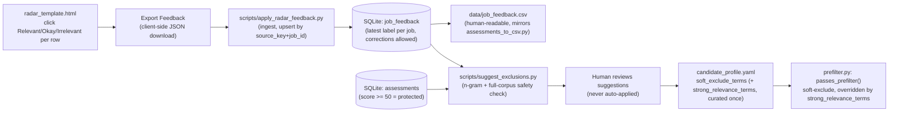

# Radar Feedback → Safe Exclusion Terms — Plan

Status: **draft — nothing in this plan is implemented yet.** No changes to `prefilter.py`,
`storage.py`, `config.py`, `render_radar.py`, or `candidate_profile.yaml` have been made.

## 1. Problem recap

The title+department-only prefilter gate (`docs/SPEC.md` §7.3) is precise but has a real recall
gap on one side (worked through in `docs/broad-match-plan.md`) and, as this session's actual radar
review just showed, a real *precision* gap too: several NVIDIA/Apple chip-and-silicon roles pass
the gate (via broad `target_domains` terms like `validation`/`verification`/`simulation`) and even
score well from the local LLM — up to 82 — while being genuinely irrelevant to an
automotive/ADAS/robotics profile. Manually reviewing a live radar report surfaced two batches of
examples (24 titles total, one company's title flipping from "okay" to "irrelevant" between
batches), which this plan turns into a durable mechanism instead of one-off chat conversation.

**The hard constraint, stated directly by the user:** any automatic filtering derived from this
feedback must never suppress a job that's actually relevant or okay — under-filtering (an
irrelevant job slips through to the LLM, costing a little review time) is acceptable;
over-filtering (a real match silently disappears) is not. This rules out similarity/ML-based
auto-filtering on its own — `docs/broad-match-plan.md` already found TF-IDF cosine similarity
unreliable in both directions on real data — in favor of a deterministic, explainable mechanism
with a provable (not just empirical) safety property, matching this project's existing
`exclude_title_terms`/`exclude_terms` philosophy.

**The specific edge case that shapes the whole design:** a bare, unconditional exclude term
(e.g. `"platform architecture"`, derived from Apple's irrelevant postings) would also reject a
hypothetical future `"ADAS Platform Architecture Engineer"` — genuinely relevant, wrongly killed,
purely because historical-corpus safety-checking can only prove "no problem seen *so far*," never
"no problem possible in the future." The design below closes that gap structurally, not
empirically.

## 2. Architecture overview



Two independent safety layers, stacked:
1. **Suggestion-time**: a candidate exclude term is only ever suggested if it appears in zero
   already-scored-relevant (≥50) or explicitly-"okay"/"relevant"-labeled jobs — empirical, based on
   everything seen so far.
2. **Match-time**: even an approved `soft_exclude_terms` entry is overridden whenever the job's
   title/department also contains one of a small, separately-curated `strong_relevance_terms` list
   — structural, true for any future title, not just ones already seen. This is what specifically
   protects the "ADAS Platform Architecture" case.

`candidate_profile.yaml` stays the single source of truth for anything that actually changes
filtering behavior — `prefilter.py` never reads `job_feedback` directly. The raw per-job feedback
log lives in SQLite for the same reason `jobs`/`assessments` already do (growing, machine-appended,
correctable history — not curated config); see §8 for why this split matters concretely.

## 3. Schema changes

### 3.1 `models.py` — new `JobFeedback`

```
JobFeedback — source_key, job_id, company, title, department (optional), score (optional,
              int — the assessment score at time of feedback, if one existed),
              label ("relevant" | "okay" | "irrelevant"), recorded_at (datetime)
```

### 3.2 `storage.py` — new `job_feedback` table

```sql
CREATE TABLE IF NOT EXISTS job_feedback (
    source_key TEXT NOT NULL, job_id TEXT NOT NULL, company TEXT NOT NULL,
    title TEXT NOT NULL, department TEXT, score INTEGER,
    label TEXT NOT NULL, recorded_at TEXT NOT NULL,
    PRIMARY KEY(source_key, job_id)
)
```

`upsert_job_feedback(feedback)` — same `ON CONFLICT DO UPDATE` pattern as `upsert_assessment`,
keyed by `(source_key, job_id)`. **Upsert, not append**, is load-bearing: this session's own
"Custom Silicon Validation Engineer - Camera Hardware" flipping from okay→irrelevant between
batches is exactly the case an append-only log would handle badly (two contradictory rows for the
same job) and an upsert handles correctly (latest label wins, silently and correctly).
`export_job_feedback()` mirrors `export_assessments()`.

### 3.3 `config.py` — two new `CandidateProfile` fields

```python
soft_exclude_terms: list[str] = Field(default_factory=list)
strong_relevance_terms: list[str] = Field(default_factory=list)
```

Both default to empty lists — fully backward compatible, no break for an existing
`candidate_profile.yaml` missing these keys.

**`strong_relevance_terms` is deliberately a new, separately-curated list, not a reuse of
`target_domains`/`target_title_terms`.** This session proved why: `target_domains` already
contains `validation`/`verification`/`simulation`/`systems engineering` — exactly the broad,
generic terms that let the Apple/NVIDIA noise through in the first place. If those were allowed to
override a soft-exclude, `"platform architecture"` would never fire at all, since every offending
job also matches "verification" or "simulation". `strong_relevance_terms` needs to be the narrow
subset of genuinely unambiguous domain nouns — `validation`/`verification`/`simulation`/`systems
engineering` are deliberately excluded from it even though they're in `target_domains` — they gate
*inclusion* fine, but are too broad to trust as an *override* signal.

**Final starting list (resolved):** `ADAS`, `autonomous driving`, `active safety`, `sensor
fusion`, `robotics`, `mechatronics`, `perception`, `behavior`, `behaviour` (both spellings kept —
matching is literal substring, so only listing one would silently miss the other), `chassis`,
`path planning`, `control systems`.

**`control systems` is a known, deliberate exception, not an oversight.** It's a literal substring
of `"Simulation and Control Systems Engineer - Platform Architecture"` — a real Apple posting
already confirmed irrelevant in this session's own feedback. Adding it to `strong_relevance_terms`
means that exact posting (and anything else matching both `platform architecture` and `control
systems`) will keep resurfacing despite being tagged irrelevant — a real, accepted false negative.
This was an explicit choice, made per the false-negatives-over-false-positives principle now
documented in `CLAUDE.md`'s "Working in this repo" section: a narrower override term (e.g.
`vehicle control systems`) would have avoided this one collision, but `control systems` bare is
judged worth keeping broad enough to reliably rescue genuine vehicle/chassis control-systems roles,
even at the cost of this one known miss. §9 adds a test asserting this exact tradeoff explicitly,
so it stays a documented decision rather than a surprise discovered later.

## 4. `prefilter.py` logic change

Current order (§7.3, unchanged for the first three checks):
1. `us_eligible` must be true.
2. `exclude_title_terms` (title only) → hard reject, always, no override. Unchanged — these are
   categorical disqualifiers (`intern`, `co-op`) where domain relevance is irrelevant to the
   decision.
3. `exclude_terms` (title+department+description) → hard reject, always, no override. Unchanged,
   same reasoning.
4. Positive match (keyword override or `target_title_terms`+`target_domains`, title+department
   only) → must match or reject.

**New step 5, after the positive-match gate passes:**
```python
soft_excluded = any(t.lower() in gate_text for t in profile.soft_exclude_terms)
rescued = any(t.lower() in gate_text for t in profile.strong_relevance_terms)
return not (soft_excluded and not rescued)
```
**Both the soft-exclude match itself and the override check use `gate_text` (title+department),
never the full description.** The plan originally scoped the soft-exclude match itself to
`full_text` (matching `exclude_terms`'s scope) and only the override check to `gate_text` — real
end-to-end testing against live data (§12) found this produces exactly the false-positive risk
the whole mechanism exists to prevent: Ford's `"Sr. Electrical System Validation Engineer"` and
`"Staff HV Electrical System Validation Engineer"` both mention "next-generation vehicle platform
architectures for electric vehicles" in their *description* — a legitimate EV context with
nothing to do with the Apple chip-org postings `platform architecture` was meant to catch — and
neither title contains anything a title-scoped `strong_relevance_terms` check could rescue. Unlike
categorical `exclude_terms` (`intern`/`co-op`, where over-excluding anywhere in the description is
low-risk), a soft-exclude is a domain-overlap pattern, not a categorical disqualifier — it needs
the same title+department discipline as the positive-match gate, not the description's full text.

Worked proof, both directions:
- `"ADAS Platform Architecture Engineer"` → `soft_exclude_terms` match (`platform architecture`)
  → `gate_text` also contains `ADAS` (in `strong_relevance_terms`) → **override fires, job kept**.
- `"Verification Platform Engineer, Platform Architecture"` (Apple, real example, scored 65-68
  historically) → `soft_exclude_terms` match → `gate_text` contains neither `ADAS` nor any other
  `strong_relevance_terms` entry (only "verification", which isn't in that narrow list) →
  **no override, job excluded**, exactly as intended.

`relevance_score()` (ordering-only heuristic) is untouched.

## 5. HTML feedback capture

### 5.1 `scripts/templates/radar_template.html` / `render_radar.py`'s `_row_html()`

**Per-row controls — inline in the collapsed `<summary>` bar, not inside the expandable detail
section.** With up to ~270 rows on a report, requiring an expand-click before tagging each job
would be far too slow — the three small buttons (👍 Relevant / 🆗 Okay / 👎 Irrelevant) sit next to
the existing score/tags in the always-visible collapsed row, so a job can be tagged while scanning
titles, without opening it. Each carries `data-source-key`/`data-job-id`/`data-company`/
`data-title`/`data-department`/`data-score` attributes already available in the row's existing
data. Pure client-side JS, no build step, no new dependency:
- Clicking a button records `{source_key, job_id, company, title, department, score, label}` into
  an in-page JS object keyed by `` `${source_key}|${job_id}` `` and visually marks the row (a
  colored left-border, say) so the reviewer can see what's been tagged so far in this viewing.
- **Clicking an already-active label toggles it back off** — removes that row's entry from
  `feedback` entirely (reverting it to genuinely untagged, not to a different label) and
  un-highlights the row. A misclick is fully recoverable before export.
- **A row nobody clicks never gets an entry in `feedback` at all — no default label, no
  "unselected = X" fallback anywhere.** This is a structural guarantee, not just a convention:
  `Object.values(feedback)` on export only ever contains rows someone explicitly tagged, so an
  untouched job is simply absent from the exported JSON, exactly as if the feature didn't exist for
  it. `apply_radar_feedback.py` only upserts rows actually present in that file and never clears
  anything first, so a job's label from a *previous* session also survives untouched if this
  session doesn't re-tag it. And in `suggest_exclusions.py`, an untagged job contributes to neither
  `irrelevant_titles` nor the explicit-feedback half of `protected_titles` — its only route into the
  analysis at all is through an existing *assessment* score (≥50 → protected), completely
  independent of whether anyone clicked a button on it. Absence of feedback is never itself a
  signal, in either direction.

**One single global control — a fixed floating button, bottom-right corner of the viewport**
(`position: fixed; bottom: 24px; right: 24px`), reading `Export Feedback (N)` where N is a live
count of rows tagged so far. Disabled/greyed out at N=0; becomes active the moment the first row
is tagged. Stays visible while scrolling the whole report, same pattern as a "back to top" widget.
Clicking it serializes `Object.values(feedback)` to JSON and triggers a browser download via a
`Blob` + temporary `<a download>` — this works because the radar report is a plain local file
opened directly (`file://`), not something published through the Artifact tool's sandbox, where
downloads are blocked; this file has no such restriction.
- No `localStorage`, no persistence across page reloads by design — each viewing is a fresh
  tagging session; the point is to export once per session, not to accumulate silently across
  reopens of `file://` URLs (which have inconsistent storage-isolation behavior across browsers
  anyway).

Exported filename: `radar-feedback-{same-stem-as-the-report}.json` (e.g.
`radar-feedback-default_2026-09-05.json`), so it's traceable back to which report it came from.

## 6. Ingestion: `scripts/apply_radar_feedback.py`

```
uv run python scripts/apply_radar_feedback.py --file ~/Downloads/radar-feedback-default_2026-09-05.json
```
Reads the JSON, validates each row against `JobFeedback`, upserts into `job_feedback`
(source_key+job_id keyed, so a label correction like this session's Apple reversal is handled
automatically), refreshes `data/job_feedback.csv` (mirrors `assessments_to_csv.py`'s pattern
exactly). Prints a summary: N new, M label-changed, K unchanged.

**`job-hunter export-feedback` (resolved — yes, add it):** a new CLI command mirroring
`export-assessments` exactly — dumps `job_feedback` and writes `data/job_feedback.csv` — for
inspecting the raw feedback log directly via the CLI without needing a fresh JSON export first.

## 7. Suggestion: `scripts/suggest_exclusions.py`

```
uv run python scripts/suggest_exclusions.py [--min-support 2] [--csv <path>]
```

**What `--min-support` actually means:** the minimum number of *different* irrelevant-tagged
titles a candidate phrase must repeat across before the tool treats it as a real, generalizable
pattern rather than a one-off characteristic of a single posting. It is **not** a technical limit
on what you're allowed to add to `soft_exclude_terms` — you always retain full manual authority to
add any term yourself, at any support level, with the same override protection from §4; it only
gates what this *automated suggestion tool* is willing to claim confidence in. Worked example from
this session's own data: `"CPU Verification Engineer"` and `"Post-Silicon Validation and
Methodology Engineer"` are each unique — no phrase from either repeats anywhere else in the
irrelevant set, so nothing from them alone clears `min_support=2`; `"platform architecture"`
repeats across two *different* titles, and `"touch hw ee validation"` repeats across two separate
reqs of the same title — both cleared the bar, which is exactly why they became real suggestions.
A one-off irrelevant job doesn't need a generalized rule to stop wasting future LLM time on *that
exact posting* anyway — `get_valid_assessment`'s `content_hash` caching already skips re-reviewing
it unless the posting itself changes; a rule only matters for catching a *different*, not-yet-seen
future job sharing the same characteristic, which single-occurrence evidence can't yet support.

Algorithm:
1. Load every `irrelevant`-labeled row from `job_feedback` → `irrelevant_titles`.
2. Build the **protected set**: every `assessments` row scoring ≥50, **plus** every
   `relevant`/`okay`-labeled `job_feedback` row (a label can correct/override an old assessment
   score, so both sources matter) → `protected_titles`.
3. Extract 1-, 2-, and 3-word n-grams from `irrelevant_titles`; keep any appearing in
   `>= min_support` (default 2) distinct irrelevant titles as high-confidence candidates.
4. For each candidate n-gram, reject it if it appears as a substring in *any* `protected_titles`
   entry (case-insensitive, matching `passes_prefilter`'s own containment semantics exactly).
5. Print survivors ranked by support count, each with: the term, how many irrelevant titles it
   matches (with examples), and explicit confirmation of zero protected-title collisions.
   **Never writes to `candidate_profile.yaml` — suggestions only, human approves each one.**
   Recommended target field for anything approved: `soft_exclude_terms`, not the absolute
   `exclude_terms`, since these are domain-overlap patterns (need the override protection from §4),
   not categorical disqualifiers.
6. **Separately, print a second section — "single-occurrence, below confidence threshold"** — every
   n-gram appearing in only one irrelevant title that still passes the protected-set safety check
   (zero collision) but hasn't repeated enough to earn the tool's own confidence. This is where
   `"cpu verification"`/`"post-silicon"`-style one-offs show up: visible, proven safe against
   history so far, explicitly labeled as *not* auto-recommended — yours to add manually if you
   judge it worth it, without the tool overclaiming a pattern it hasn't actually observed twice.

### 7.1 The sanity-check diff — showing the concrete effect before approving anything

A historical "zero collisions so far" proof isn't the same as *seeing* what a term actually does —
so for every surviving candidate, the script also runs it against a real, current search archive
(the newest one by default, or `--search <path>` for a specific one) and prints two concrete lists,
not just a claim:

- **"Would exclude N current candidate(s):"** — every job in that archive the term would newly
  reject, by title/company, so you can eyeball exactly what disappears before it does.
- **"Rescued by `strong_relevance_terms` (M):"** — every job that matched the soft-exclude term but
  also matched an override term, listed explicitly even when the list is empty (an explicit "0,
  none rescued this time" beats silence). This is what actually lets you confirm the
  ADAS-Platform-Architecture-style override is working, rather than trusting it in the abstract —
  if a real job like that existed in the current archive, it would show up here, visibly kept.

Only after seeing both lists does a term get manually added to `soft_exclude_terms`.

Validated against this session's real data already (manually, ahead of building the script):
`platform architecture` — 5 historical occurrences, 100% Apple, zero survive as protected once the
label correction is applied — is exactly the kind of clean signal this is designed to surface.
Single generic words (`verification`, `simulation`, `wireless`) correctly get rejected against the
full 394-assessment corpus, even though they look specific against a small feedback batch alone —
proof the full-corpus check (not just explicit feedback) is necessary, not optional.

## 8. Why `job_feedback` is SQLite, not YAML (the question that prompted this plan)

`candidate_profile.yaml` stays the only thing `prefilter.py` reads — one source of truth for
*filtering behavior* is preserved and non-negotiable. But the raw per-job click log is a different
kind of thing: growing, machine-appended, correctable (labels change, as this session's own example
showed), and already has an exact architectural precedent in this codebase — `assessments` is the
same shape of data (per-job, per-run, machine-written) and already lives in SQLite with a CSV
export for human browsing, not in a YAML file, for exactly this reason. Stuffing a
correction-prone, ever-growing per-job log into YAML would make it unwieldy and hard to diff as it
reaches hundreds of rows; SQLite-with-upsert plus a CSV view gives you the same "I can go look at
it" property the YAML request was actually asking for, without conflating data with config.

## 9. Testing plan

- `tests/test_prefilter.py`: new cases proving both directions of §4's worked example explicitly
  (`ADAS Platform Architecture Engineer` kept; `Verification Platform Engineer, Platform
  Architecture`-style title excluded) — the exact scenario that motivated this design, made
  permanent as a regression test. **Also a case documenting the accepted `control systems`
  tradeoff explicitly**: `"Simulation and Control Systems Engineer - Platform Architecture"` must
  be asserted as *kept* (rescued by `control systems`) — a deliberate false negative, tested so it
  reads as an intentional decision if anyone (including a future session) is tempted to "fix" it.
- `tests/test_storage.py`: `job_feedback` upsert (insert, then a label-correction upsert changes
  the row rather than duplicating it), `export_job_feedback()`.
- New `tests/test_suggest_exclusions.py`: n-gram extraction + protected-set rejection on a small
  synthetic corpus, including a case proving a generic term gets rejected due to one protected
  collision, and a case proving a specific multi-word phrase survives. **Also an explicit case for
  the untagged-job guarantee:** a job with no `job_feedback` row and a score below 50 (so it's
  protected by neither mechanism) must never appear in, or influence the outcome of, either
  `irrelevant_titles` or `protected_titles` — proving silence is truly neutral, not a hidden default.
- New `tests/test_apply_radar_feedback.py`: ingesting a JSON export that omits a job which already
  has an existing `job_feedback` row must leave that row completely unchanged (not cleared, not
  reset to any default) — proving a session that doesn't re-tag a previously-labeled job can't
  silently erase its prior label.
- `tests/test_render_radar.py`: the feedback buttons render with correct `data-*` attributes per
  row (no need to test the JS export logic itself under pytest — that's browser-side).

## 10. Rollout order

1. `models.py`/`config.py`/`storage.py` schema changes (§3) — no behavior change yet, additive only.
2. `prefilter.py` logic change + tests (§4, §9) — inert until `soft_exclude_terms` is non-empty.
3. HTML feedback capture (§5) — inert until a report is actually clicked on.
4. `apply_radar_feedback.py` (§6) + `suggest_exclusions.py` (§7) + tests.
5. Bootstrap: ingest this session's two chat-typed batches (24 titles, with the label correction)
   directly into `job_feedback` as the first real dataset, run `suggest_exclusions.py` against it,
   review the output together, and manually add whatever's approved (`platform architecture` looks
   like a clear first candidate) plus the initial `strong_relevance_terms` list to
   `candidate_profile.yaml`.
6. Update `docs/SPEC.md`/`CLAUDE.md` to document the new mechanism once built.

## 11. Resolved decisions

All three prior open questions are now settled:

1. **`strong_relevance_terms` final list**: `ADAS`, `autonomous driving`, `active safety`,
   `sensor fusion`, `robotics`, `mechatronics`, `perception`, `behavior`, `behaviour`, `chassis`,
   `path planning`, `control systems` — see §3.3 for the full list and the deliberate `control
   systems` tradeoff.
2. **`--min-support` stays 2** — it's a confidence threshold for the automated suggestion tool
   only, not a limit on manual additions; see §7's expanded explanation and the new
   "single-occurrence, below confidence threshold" output section (§7, point 6) for how one-off
   examples like `cpu verification`/`post-silicon` remain visible and addable by hand.
3. **`job-hunter export-feedback` — yes, build it**, mirroring `export-assessments` exactly (§6).

No open questions remain before implementation begins.

## 12. Implementation notes (built 2026-09-05)

Everything in §3-§7 is implemented as designed, with two real bugs found and fixed via
end-to-end testing against live data rather than unit tests alone — both are now permanent
regression tests, and both changed the design in this document (already reflected above, not
just noted here):

1. **Scope fix (§4):** `soft_exclude_terms` matching was narrowed from `full_text` to
   `gate_text` (title+department only) — see §4's updated text for the real Ford false-positive
   this fixes.
2. **Protected-set self-collision (§7):** a job tagged `irrelevant` via feedback but still
   sitting at its own pre-correction assessment score (≥50) was counting as its *own* protected
   collision, since the same job appeared in both `irrelevant_titles` (via the label) and
   `protected_titles` (via the stale score) simultaneously — meaning `platform architecture`
   could never have been suggested at all, since every job containing that phrase collided with
   itself. Fixed in `_build_title_sets`: an explicit `irrelevant` label now excludes that job's
   own score from the protected set, regardless of what the score is. `tests/
   test_suggest_exclusions.py::test_irrelevant_label_overrides_that_jobs_own_stale_assessment_score`
   is the regression test.

**Bootstrap run, for real, against this session's own 63 feedback entries** (the conversation's
two irrelevant batches plus the corrected okay/irrelevant labels, matched against real stored
job records): `platform architecture` survived both the historical safety check and the corrected
title-scoped diff preview cleanly — 4 genuine Apple postings excluded, 1 rescued exactly as
designed (`"Simulation and Control Systems Engineer - Platform Architecture"`, via the accepted
`control systems` tradeoff from §3.3), zero Ford/NVIDIA false positives once the scope fix landed.
`touch hw` (or equivalently `touch hw ee validation`) also came out clean — 3 genuine Apple
"Touch HW EE Validation Engineer" duplicates, zero rescues, zero collisions. A long tail of
single-word candidates (`cad`, `cpu`, `hw`, `mixed`, `signal`) also passed the historical safety
check but are **not recommended** — each would exclude a large number of current candidates while
only partially rescuing them via `strong_relevance_terms`, exactly the generic-term risk this
whole design is built to avoid defaulting into. Left for manual review, not auto-applied, per the
tool's own stated behavior.
