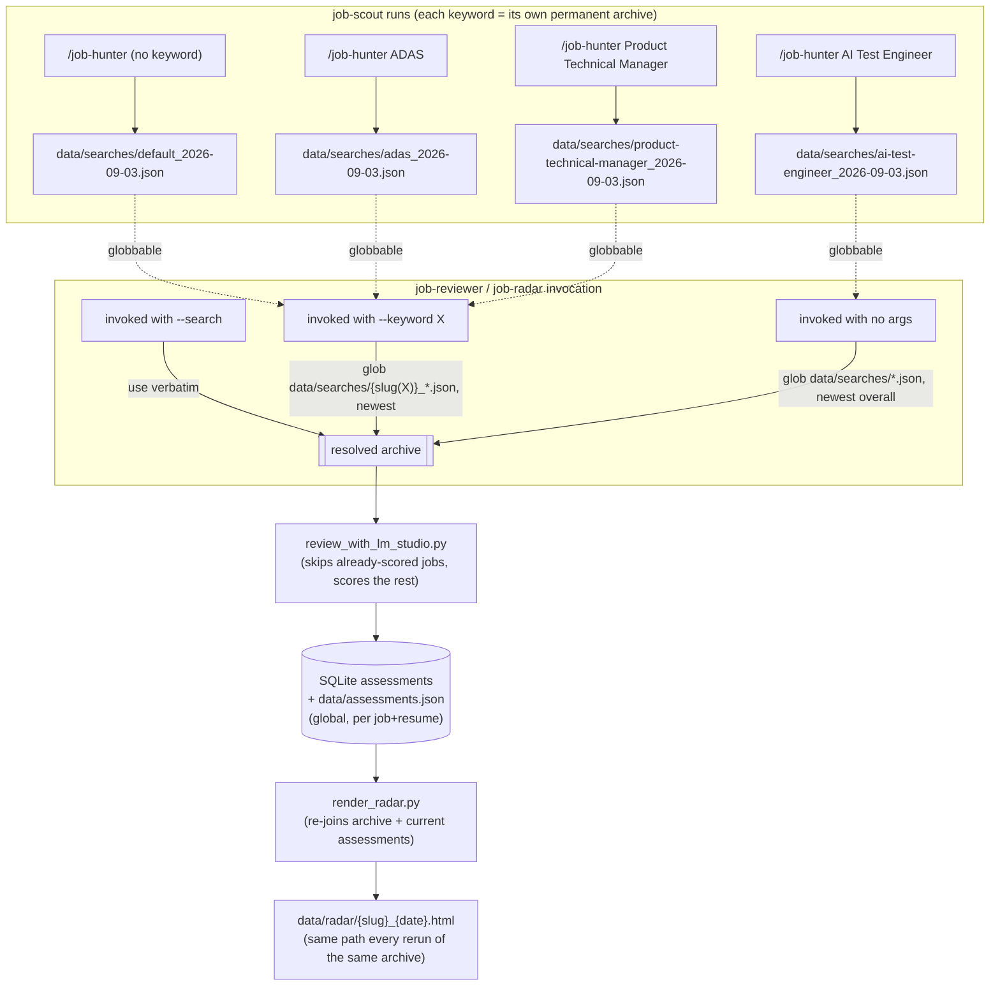
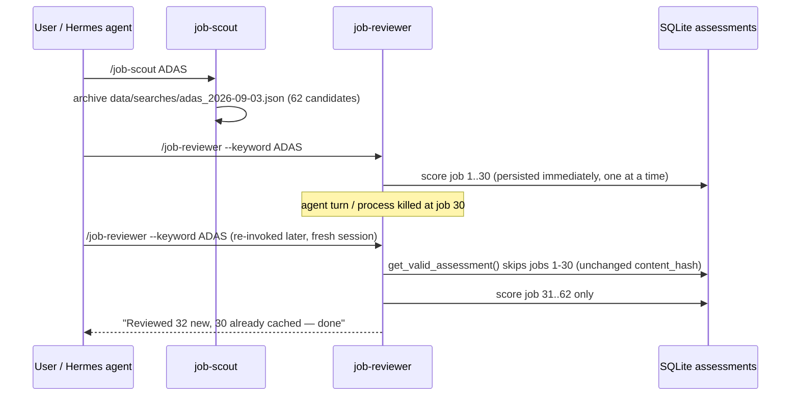

# Skill Split Plan: `job-hunter` → orchestrator + job-scout + job-reviewer + job-radar

Status: **draft for review — nothing in this plan has been implemented yet.**

## 1. Goal

Split the single monolithic `skills/job-hunter/SKILL.md` (12 sequential steps: read profile →
search → filter → review → compile → render) into independently-invocable skills that map onto
the pipeline stages that already exist as separate Python/CLI entry points:

- **job-scout** — wraps `job-hunter search` (collection + prefilter). Expandable later beyond
  keyword/profile-driven matching without touching the other stages.
- **job-reviewer** — wraps `scripts/review_with_lm_studio.py` (local-LLM scoring). Long-running,
  must be safely resumable if interrupted.
- **job-radar** — wraps `scripts/render_radar.py` (HTML report + artifact publish). Must reflect
  whatever's been reviewed *so far*, re-runnable at any time.
- **job-hunter** (kept as the existing name) — becomes the thin orchestrator: runs the three in
  sequence for the "just do the whole thing" case, then owns the one step that genuinely needs
  agent judgment (compiling verdicts into the two-tier report — today's steps 9–12).

Must work identically across every runtime `install_skill.sh` targets (Hermes, Claude Code
global/local, OpenCode) — they only share the `SKILL.md` file format, not necessarily
skill-to-skill invocation semantics, so the design below does not depend on one skill's
instructions being able to invoke another skill programmatically.

## 2. Proposed file layout

```
skills/
  job-hunter/                    # orchestrator (existing name/install path kept)
    SKILL.md                     # short: resolve args, run the 3 stages, compile + report

  job-scout/
    SKILL.md                     # today's steps 1-6: profile/resume, keyword normalization,
                                  # run `job-hunter search --archive`, report prefilter count

  job-reviewer/
    SKILL.md                     # today's steps 7-8: resolve input, run review script,
                                  # report reviewed/skipped/remaining, csv export
    references/
      scoring.md                # MOVED from job-hunter/references/ — this is the rubric
                                 # embedded in review_with_lm_studio.py's prompt, reviewer's
                                 # concern specifically, not orchestrator's

  job-radar/
    SKILL.md                     # today's steps 9-10: resolve search+keyword, compile
                                  # text summary, render + publish HTML
```

`job-hunter/references/troubleshooting.md` moves to **job-scout/references/troubleshooting.md** —
its content (`doctor`, `source-status`, `source-test`, the `stealth_html` ToS-exposure note) is
entirely about collection/adapter failures, which is job-scout's domain, not the orchestrator's.

`install_skill.sh` needs one change: install all four skill directories (loop over
`job-hunter job-scout job-reviewer job-radar` instead of the single hardcoded name) to each of
the four runtime targets.

## 3. Responsibility boundaries

| Skill | Wraps | Reads | Writes | Needs agent judgment for |
|---|---|---|---|---|
| job-scout | `job-hunter search --archive [--keyword ...]` | `candidate_profile.yaml`, resume | `data/searches/{slug}_{date}.json` | normalizing free-text keyword args into the `--keyword` list format |
| job-reviewer | `scripts/review_with_lm_studio.py` | a `data/searches/*.json` archive | SQLite `assessments` + `data/assessments.json` (per-job, immediately) | none — it's a deterministic wrapper; report progress verbatim |
| job-radar | `scripts/render_radar.py` | the same archive + `data/assessments.json` | `data/radar/{slug}_{date}.html` (+ artifact publish) | none for rendering; text-summary compile (steps 9-12 logic) does need judgment when done standalone |
| job-hunter (orchestrator) | all three, in sequence | — | — | compiling final verdicts into the Strong/For-review report, tagging, caveats |

## 4. State handoff: resolving "which search" without a maintained pointer file

**Rejected approach:** a single `data/state/last_search.json` "latest" pointer. Breaks as soon as
more than one keyword is in flight — after running ADAS, then Product Technical Manager, then AI
Test Engineer, a single pointer only remembers the last one, so job-reviewer/job-radar could no
longer be pointed at the ADAS run without an explicit path. Also a second source of truth that can
drift from what's actually on disk.

**Chosen approach:** resolve on demand from the archive directory itself, since
`archive_path()`'s `{slug}_{date}.json` naming is already deterministic and never overwrites a
*different* keyword or day. No new persisted state, nothing to keep in sync:

```
resolve_search(*, search_path=None, keyword=None) -> Path:
    if search_path given: return it verbatim, no resolution
    if keyword given:     slugify it the same way archive_path() does,
                          glob data/searches/{slug}_*.json, return newest by date
    else:                 glob data/searches/*.json, return newest overall
```

This needs `_slugify` (currently private in `cli.py`) promoted to a shared, importable function —
or exposed as a tiny `job-hunter resolve-search --keyword "..."` CLI command — so job-reviewer and
job-radar resolve a keyword to a filename identically to how job-scout named it. One
implementation, not three copies.

`review_with_lm_studio.py --input` and `render_radar.py --search`/`--keyword` both gain this
resolver as their default when the flag is omitted; explicit values always win.

### The "no-args" default is a cold-start convenience, not a resume guarantee

If job-scout ran ADAS, got interrupted before review, and *then* Product Technical Manager ran, a
bare no-arg job-reviewer now resolves to PTM — the newest archive overall — not the still-unfinished
ADAS run. This is fine for "I don't remember/care which run" but wrong for "resume what I was just
doing." Rule for skill instructions: **whenever a skill invocation already knows the keyword it's
operating on (job-scout always does — it was just told), it must pass `--keyword` explicitly to
job-reviewer/job-radar rather than relying on the no-arg default.** The default only serves a
genuinely cold session with no context at all.

## 5. Resumability (already mostly solved, needs wiring)

`review_with_lm_studio.py` already persists each verdict immediately inside its loop
(`storage.upsert_assessment` + `_refresh_export`, scripts/review_with_lm_studio.py:302-315) *before*
moving to the next candidate, and skips anything already assessed with a matching `content_hash`
on the next run. So interrupting the process and re-running the identical command is already a
correct resume — no new resume logic needed at the script level. What's added by this plan:

- `--status` flag on `review_with_lm_studio.py`: computes and prints the `to_review` count with no
  model calls, so job-reviewer can report "12 of 40 already scored, 28 remaining" instantly,
  whether starting fresh or resuming.
- The resolver above, so a fresh/cold job-reviewer invocation can find the right archive to resume
  against without being told the exact path.
- Optional (build only if interruptions keep happening after the above): run the review as a
  detached background process with a lockfile (`data/state/review.lock`: pid + start time) so a
  Hermes agent turn timing out doesn't kill the review itself — job-reviewer's contract becomes
  "attach to a running review if the lock is live, else start one," rather than blocking
  synchronously for the full duration.

### Confirmed: resume changes never trigger re-review, and new reviews always use the current resume

Two facts, verified directly against `review_with_lm_studio.py` and `storage.py`, both already
correct and intentionally kept as-is (no implementation change needed):

- **A new/changed job is always scored against whatever resume is on disk at run time.**
  `review_with_lm_studio.py:244` reads `profile.resume_path` fresh at the top of every invocation
  — never a cached/stored resume snapshot — so any cache-miss review (new posting, or one whose
  `content_hash` changed) reflects your current resume.
- **An already-cached job's verdict is never invalidated by a resume change.** `get_valid_assessment`
  (storage.py:343-354) matches on `content_hash` only, never on `resume_path`. Updating your resume
  does not force re-review of anything already scored — by design, per explicit preference: scoring
  the same posting again just because the resume changed isn't worth the review cost.
- Net effect: `assessments` can (and will) hold verdicts scored against different resume versions
  for different jobs over time — a job reviewed last month still carries last month's resume's
  verdict. `resume_path` is stored per assessment for audit/inspection only, not enforcement.
  `--force` remains the manual escape hatch if a full re-score against a new resume is ever wanted.

## 6. Radar freshness (already works, just needs the resolver)

`render_radar.py` re-joins the *current* `assessments.json` against the archive on every
invocation (build(), lines 127-172) and reports `never_reviewed` explicitly — it already reflects
partial review progress correctly, and its output path is derived from the search file's own stem,
so re-running it against the same archive always overwrites the same file/artifact. The only
missing piece is the same resolver from §4 so `--search`/`--keyword` aren't required.

## 7. Flow diagram — four scenarios + resolution



## 8. Sequence diagram — interrupted review, resumed later



## 9. What stays exactly as-is

- `passes_prefilter`, `evaluate_location`, `evaluate_sponsorship`, recency filtering — untouched,
  Python-side, no skill boundary crosses them.
- Assessments remain global (per job+resume), never split per search/keyword — this is what makes
  cross-keyword overlap free and is already correct.
- `render_radar.py`'s pure-presentation, never-re-derive-a-score contract — untouched.

## 10. Open decisions before implementation

1. **Orchestrator internals:** job-hunter's `SKILL.md` should directly run the same CLI/script
   commands job-scout/job-reviewer/job-radar document (not invoke them via a Skill-tool call),
   since cross-skill invocation support isn't confirmed for Hermes/OpenCode. Each sub-skill's
   `SKILL.md` stays the canonical procedure text for its stage; the orchestrator's stays short and
   references them rather than duplicating their prose. Confirm this is acceptable, since it means
   the orchestrator and the sub-skills must be kept in sync by convention, not by one calling the
   other.
2. **`--status` and background/lockfile review (§5):** build the cheap `--status` flag now; hold
   off on the background-process/lockfile version until we confirm plain resume (rerun the same
   command) isn't already enough in practice on Hermes.
3. **Rollout order:** suggest building in this order — (a) shared resolver + slugify promotion,
   (b) job-scout/job-reviewer/job-radar as standalone skills wrapping today's scripts unchanged,
   (c) shrink job-hunter's `SKILL.md` down to the orchestrator role, (d) update
   `install_skill.sh` to install all four. Confirm before starting.
